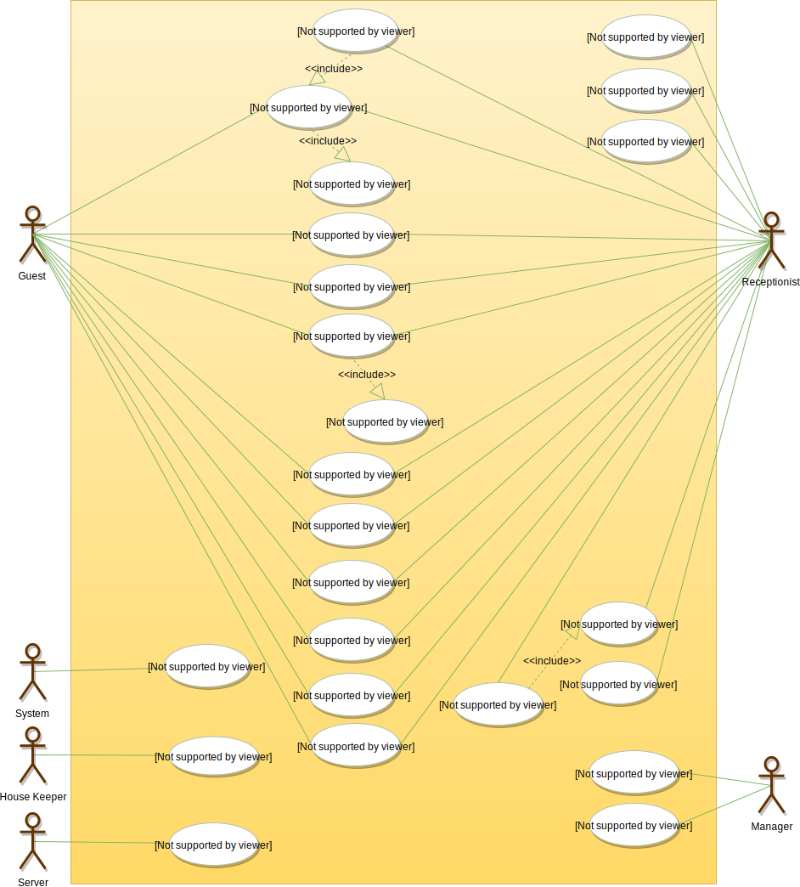
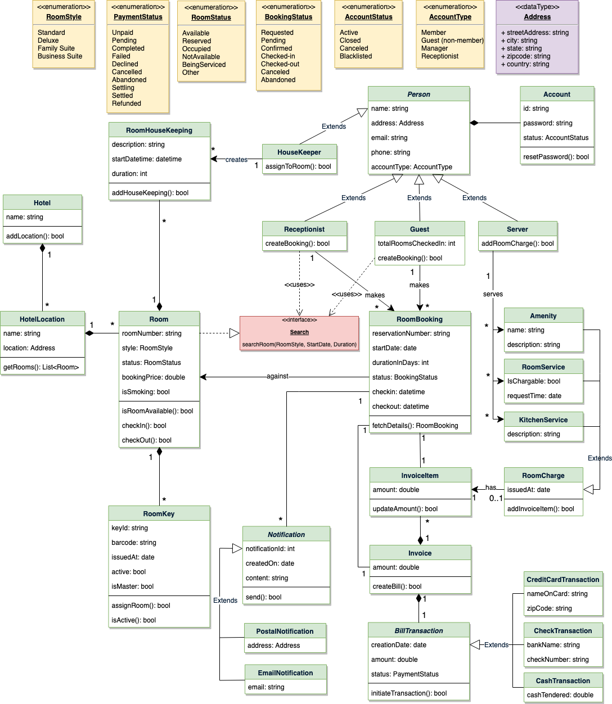

# Designing a Hotel Management System

A Hotel Management System is a software built to handle all online hotel activities easily and safely. This System will give the hotel management power and flexibility to manage the entire system from a single online portal. The system allows the manager to keep track of all the available rooms in the system as well as to book rooms and generate bills.

## Requirements

- The system should support the booking of different room types like standard, deluxe, family suite, etc.
- Guests should be able to search the room inventory and book any available room.
- The system should be able to retrieve information, such as who booked a particular room, or what rooms were booked by a specific customer.
- The system should allow customers to cancel their booking - and provide them with a full refund if the cancelation occurs before 24 hours of the check-in date.
- The system should be able to send notifications whenever the booking is nearing the check-in or check-out date.
- The system should maintain a room housekeeping log to keep track of all housekeeping tasks.
- Any customer should be able to add room services and food items.
- Customers can ask for different amenities.
- The customers should be able to pay their bills through credit card, check or cash.

## Use Case Diagram

### Actors

- Guest: All guests can search the available rooms, as well as make a booking.
- Receptionist: Mainly responsible for adding and modifying rooms, creating room bookings, check-in, and check-out customers.
- System: Mainly responsible for sending notifications for room booking, cancellation, etc.
- Manager: Mainly responsible for adding new workers.
- Housekeeper: To add/modify housekeeping record of rooms.
- Server: To add/modify room service record of rooms.

### Processes

- Add/Remove/Edit room: To add, remove, or modify a room in the system.
- Search room: To search for rooms by type and availability.
- Register or cancel an account: To add a new member or cancel the membership of an existing member.
- Book room: To book a room.
- Check-in: To let the guest check-in for their booking.
- Check-out: To track the end of the booking and the return of the room keys.
- Add room charge: To add a room service charge to the customer’s bill.
- Update housekeeping log: To add or update the housekeeping entry of a room.



## Class Diagram

- Hotel and HotelLocation: Our system will support multiple locations of a hotel.
- Room: The basic building block of the system. Every room will be uniquely identified by the room number. Each Room will have attributes like Room Style, Booking Price, etc.
- Account: We will have different types of accounts in the system: one will be a guest to search and book rooms, another will be a receptionist. Housekeeping will keep track of the housekeeping records of a room, and a Server will handle room service.
- RoomBooking: This class will be responsible for managing bookings for a room.
- Notification: Will take care of sending notifications to guests.
- RoomHouseKeeping: To keep track of all housekeeping records for rooms.
- RoomCharge: Encapsulates the details about different types of room services that guests have requested.
- Invoice: Contains different invoice-items for every charge against the room.
- RoomKey: Each room can be assigned an electronic key card. Keys will have a barcode and will be uniquely identified by a key-ID.




## Activity Diagram

### Make Booking


### Check In


### Cancel Booking


## Code

### Constants and Enums

```java
public enum RoomStyle {
  STANDARD, DELUXE, FAMILY_SUITE, BUSINESS_SUITE
}

public enum RoomStatus {
  AVAILABLE, RESERVED, OCCUPIED, NOT_AVAILABLE, BEING_SERVICED, OTHER
}

public enum BookingStatus {
  REQUESTED, PENDING, CONFIRMED, CHECKED_IN, CHECKED_OUT, CANCELLED, ABANDONED
}

public enum AccountStatus {
  ACTIVE, CLOSED, CANCELED, BLACKLISTED, BLOCKED
}

public enum AccountType {
  MEMBER, GUEST, MANAGER, RECEPTIONIST
}

public enum PaymentStatus {
  UNPAID, PENDING, COMPLETED, FILLED, DECLINED, CANCELLED, ABANDONED, SETTLING, SETTLED, REFUNDED
}

public class Address {
  private String streetAddress;
  private String city;
  private String state;
  private String zipCode;
  private String country;
}
```

### Account, Person, Guest, Receptionist, and Server

```java
// For simplicity, we are not defining getter and setter functions. The reader can
// assume that all class attributes are private and accessed through their respective
// public getter method and modified only through their public setter method.

public class Account {
  private String id;
  private String password;
  private AccountStatus status;

  public boolean resetPassword();
}

public abstract class Person {
  private String name;
  private Address address;
  private String email;
  private String phone;

  private Account account;
}


public class Guest extends Person {
  private int totalRoomsCheckedIn;

  public List<RoomBooking> getBookings();
}

public class Receptionist extends Person {
  public List<Member> searchMember(String name);
  public boolean createBooking();
}

public class Server extends Person {
  public boolean addRoomCharge(Room room, RoomCharge roomCharge);
}
```

### Hotel and HotelLocation

```java
public class HotelLocation {
  private String name;
  private Address location;

  public Address getRooms();
}

public class Hotel {
  private String name;
  private List<HotelLocation> locations;

  public boolean addLocation(HotelLocation location);
}
```

### Room, RoomKey, and RoomHouseKeeping

```java
public interface Search {
  public static List<Room> search(RoomStyle style, Date startDate, int duration);
}

public class Room implements Search {
  private String roomNumber;
  private RoomStyle style;
  private RoomStatus status;
  private double bookingPrice;
  private boolean isSmoking;

  private List<RoomKey> keys;
  private List<RoomHouseKeeping> houseKeepingLog;

  public boolean isRoomAvailable();
  public boolean checkIn();
  public boolean checkOut();

  public static List<Room> search(RoomStyle style, Date startDate, int duration) {
    // return all rooms with the given style and availability
  }
}

public class RoomKey {
  private String keyId;
  private String barcode;
  private Date issuedAt;
  private boolean active;
  private boolean isMaster;

  public boolean assignRoom(Room room);
  public boolean isActive();
}

public class RoomHouseKeeping
 {
  private String description;
  private Date startDatetime;
  private int duration;
  private HouseKeeper houseKeeper;

  public boolean addHouseKeeping(Room room);
}
```

### RoomBooking and RoomCharge

```java
public class RoomBooking {
  private String reservationNumber;
  private Date startDate;
  private int durationInDays;
  private BookingStatus status;
  private Date checkin;
  private Date checkout;

  private int guestID;
  private Room room;
  private Invoice invoice;
  private List<Notification> notifications;

  public static RoomBooking fectchDetails(String reservationNumber);
}

public abstract class RoomCharge {
  public Date issueAt;
  public boolean addInvoiceItem(Invoice invoice);
}

public class Amenity extends RoomCharge {
  public String name;
  public String description;
}

public class RoomService extends RoomCharge {
  public boolean isChargeable;
  public Date requestTime;
}

public class KitchenService extends RoomCharge {
  public String description;
}
```
