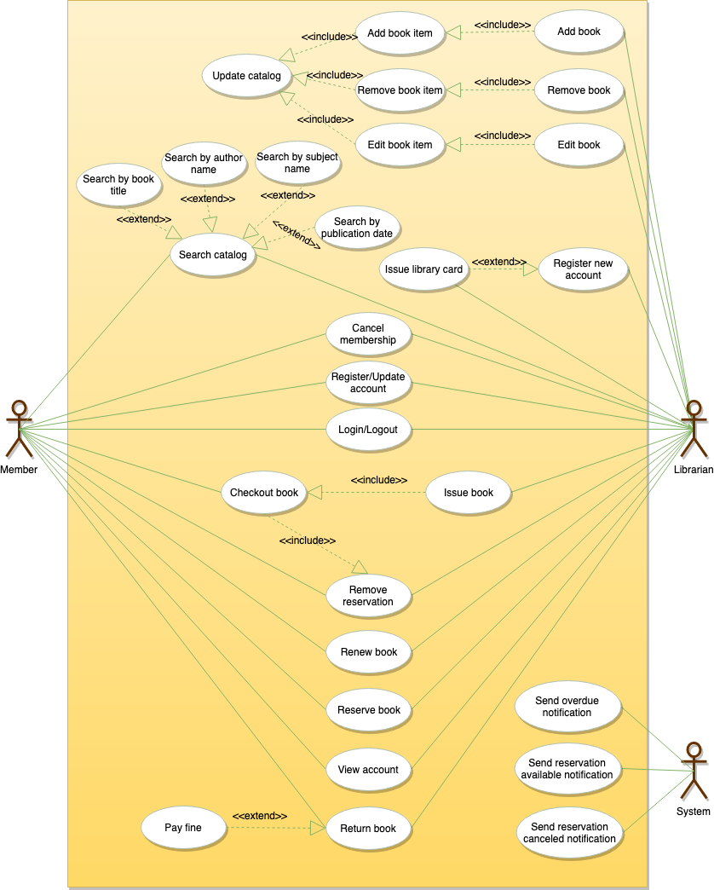
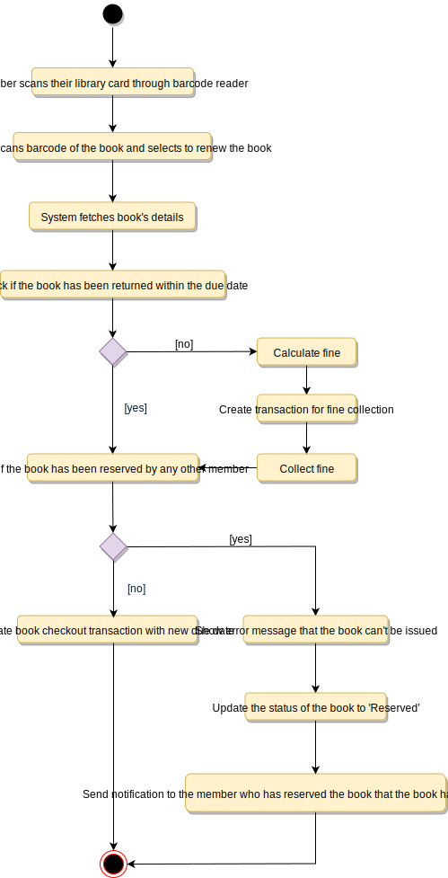

# Designing a Library Management

A Library Management System is a software built to handle the primary housekeeping functions of a library. Libraries rely on library management systems to manage asset collections as well as relationships with their members. Library management systems help libraries keep track of the books and their checkouts, as well as members’ subscriptions and profiles.

Library management systems also involve maintaining the database for entering new books and recording books that have been borrowed with their respective due dates.

## Requirements

- Any library member should be able to search books by their title, author, subject category as well by the publication date.
- Each book will have a unique identification number and other details including a rack number which will help to physically locate the book.
- There could be more than one copy of a book, and library members should be able to check-out and reserve any copy. We will call each copy of a book, a book item.
- The system should be able to retrieve information like who took a particular book or what are the books checked-out by a specific library member.
- There should be a maximum limit (5) on how many books a member can check-out.
- There should be a maximum limit (10) on how many days a member can keep a book.
- The system should be able to collect fines for books returned after the due date.
- Members should be able to reserve books that are not currently available.
- The system should be able to send notifications whenever the reserved books become available, as well as when the book is not returned within the due date.
- Each book and member card will have a unique barcode. The system will be able to read barcodes from books and members’ library cards.

## Use Case Diagram

### Actors

- Librarian: Mainly responsible for adding and modifying books, book items, and users. The Librarian can also issue, reserve, and return book items.
- Member: All members can search the catalog, as well as check-out, reserve, renew, and return a book.
- System: Mainly responsible for sending notifications for overdue books, canceled reservations, etc.

### Processes

- Add/Remove/Edit book: To add, remove or modify a book or book item.
- Search catalog: To search books by title, author, subject or publication date.
- Register new account/cancel membership: To add a new member or cancel the membership of an existing member.
- Check-out book: To borrow a book from the library.
- Reserve book: To reserve a book which is not currently available.
- Renew a book: To reborrow an already checked-out book.
- Return a book: To return a book to the library which was issued to a member.



## Class Diagram

- Library: The central part of the organization for which this software has been designed. It has attributes like ‘Name’ to distinguish it from any other libraries and ‘Address’ to describe its location.
- Book: The basic building block of the system. Every book will have ISBN, Title, Subject, Publishers, etc.
- BookItem: Any book can have multiple copies, each copy will be considered a book item in our system. Each book item will have a unique barcode.
- Account: We will have two types of accounts in the system, one will be a general member, and the other will be a librarian.
- LibraryCard: Each library user will be issued a library card, which will be used to identify users while issuing or returning books.
- BookReservation: Responsible for managing reservations against book items.
- BookLending: Manage the checking-out of book items.
- Catalog: Catalogs contain list of books sorted on certain criteria. Our system will support searching through four catalogs: Title, Author, Subject, and Publish-date.
- Fine: This class will be responsible for calculating and collecting fines from library members.
- Author: This class will encapsulate a book author.
- Rack: Books will be placed on racks. Each rack will be identified by a rack number and will have a location identifier to describe the physical location of the rack in the library.
- Notification: This class will take care of sending notifications to library members.


## Activity Diagram

### Check Out Book


### Return Book


### Renew Book



## Code

### Constants and Enums

```java
public enum BookFormat {
  HARDCOVER,
  PAPERBACK,
  AUDIO_BOOK,
  EBOOK,
  NEWSPAPER,
  MAGAZINE,
  JOURNAL
}

public enum BookStatus {
  AVAILABLE,
  RESERVED,
  LOANED,
  LOST
}

public enum ReservationStatus{
  WAITING,
  PENDING,
  CANCELED,
  NONE
}

public enum AccountStatus{
  ACTIVE,
  CLOSED,
  CANCELED,
  BLACKLISTED,
  NONE
}

public class Address {
  private String streetAddress;
  private String city;
  private String state;
  private String zipCode;
  private String country;
}

public class Person {
  private String name;
  private Address address;
  private String email;
  private String phone;
}

public class Constants {
  public static final int MAX_BOOKS_ISSUED_TO_A_USER = 5;
  public static final int MAX_LENDING_DAYS = 10;
}
```

### Account, Member, and Librarian

```java
// For simplicity, we are not defining getter and setter functions. The reader can
// assume that all class attributes are private and accessed through their respective
// public getter methods and modified only through their public methods function.

public abstract class Account {
  private String id;
  private String password;
  private AccountStatus status;
  private Person person;

  public boolean resetPassword();
}

public class Librarian extends Account {
  public boolean addBookItem(BookItem bookItem);

  public boolean blockMember(Member member);

  public boolean unBlockMember(Member member);
}

public class Member extends Account {
  private Date dateOfMembership;
  private int totalBooksCheckedout;

  public int getTotalBooksCheckedout();

  public boolean reserveBookItem(BookItem bookItem);

  private void incrementTotalBooksCheckedout();

  public boolean checkoutBookItem(BookItem bookItem) {
    if (this.getTotalBooksCheckedOut() >= Constants.MAX_BOOKS_ISSUED_TO_A_USER) {
      ShowError("The user has already checked-out maximum number of books");
      return false;
    }
    BookReservation bookReservation = BookReservation.fetchReservationDetails(bookItem.getBarcode());
    if (bookReservation != null && bookReservation.getMemberId() != this.getId()) {
      // book item has a pending reservation from another user
      ShowError("This book is reserved by another member");
      return false;
    } else if (bookReservation != null) {
      // book item has a pending reservation from the give member, update it
      bookReservation.updateStatus(ReservationStatus.COMPLETED);
    }

    if (!bookItem.checkout(this.getId())) {
      return false;
    }

    this.incrementTotalBooksCheckedout();
    return true;
  }

  private void checkForFine(String bookItemBarcode) {
    BookLending bookLending = BookLending.fetchLendingDetails(bookItemBarcode);
    Date dueDate = bookLending.getDueDate();
    Date today = new Date();
    // check if the book has been returned within the due date
    if (today.compareTo(dueDate) > 0) {
      long diff = todayDate.getTime() - dueDate.getTime();
      long diffDays = diff / (24 * 60 * 60 * 1000);
      Fine.collectFine(memberId, diffDays);
    }
  }

  public void returnBookItem(BookItem bookItem) {
    this.checkForFine(bookItem.getBarcode());
    BookReservation bookReservation = BookReservation.fetchReservationDetails(bookItem.getBarcode());
    if (bookReservation != null) {
      // book item has a pending reservation
      bookItem.updateBookItemStatus(BookStatus.RESERVED);
      bookReservation.sendBookAvailableNotification();
    }
    bookItem.updateBookItemStatus(BookStatus.AVAILABLE);
  }

  public bool renewBookItem(BookItem bookItem) {
    this.checkForFine(bookItem.getBarcode());
    BookReservation bookReservation = BookReservation.fetchReservationDetails(bookItem.getBarcode());
    // check if this book item has a pending reservation from another member
    if (bookReservation != null && bookReservation.getMemberId() != this.getMemberId()) {
      ShowError("This book is reserved by another member");
      member.decrementTotalBooksCheckedout();
      bookItem.updateBookItemState(BookStatus.RESERVED);
      bookReservation.sendBookAvailableNotification();
      return false;
    } else if (bookReservation != null) {
      // book item has a pending reservation from this member
      bookReservation.updateStatus(ReservationStatus.COMPLETED);
    }
    BookLending.lendBook(bookItem.getBarCode(), this.getMemberId());
    bookItem.updateDueDate(LocalDate.now().plusDays(Constants.MAX_LENDING_DAYS));
    return true;
  }
}
```

### BookReservation, BookLending, and Fine

```java
public class BookReservation {
  private Date creationDate;
  private ReservationStatus status;
  private String bookItemBarcode;
  private String memberId;

  public static BookReservation fetchReservationDetails(String barcode);
}

public class BookLending {
  private Date creationDate;
  private Date dueDate;
  private Date returnDate;
  private String bookItemBarcode;
  private String memberId;

  public static boolean lendBook(String barcode, String memberId);
  public static BookLending fetchLendingDetails(String barcode);
}

public class Fine {
  private Date creationDate;
  private double bookItemBarcode;
  private String memberId;

  public static void collectFine(String memberId, long days) {}
}
```

### BookItem

```java
public abstract class Book {
  private String ISBN;
  private String title;
  private String subject;
  private String publisher;
  private String language;
  private int numberOfPages;
  private List<Author> authors;
}

public class BookItem extends Book {
  private String barcode;
  private boolean isReferenceOnly;
  private Date borrowed;
  private Date dueDate;
  private double price;
  private BookFormat format;
  private BookStatus status;
  private Date dateOfPurchase;
  private Date publicationDate;
  private Rack placedAt;

  public boolean checkout(String memberId) {
    if(bookItem.getIsReferenceOnly()) {
      ShowError("This book is Reference only and can't be issued");
      return false;
    }
    if(!BookLending.lendBook(this.getBarCode(), memberId)){
      return false;
    }
    this.updateBookItemStatus(BookStatus.LOANED);
    return true;
  }
}

public class Rack {
  private int number;
  private String locationIdentifier;
}
```

### Search Interface and Catalog

```java
public interface Search {
  public List<Book> searchByTitle(String title);
  public List<Book> searchByAuthor(String author);
  public List<Book> searchBySubject(String subject);
  public List<Book> searchByPubDate(Date publishDate);
}

public class Catalog implements Search {
  private HashMap<String, List<Book>> bookTitles;
  private HashMap<String, List<Book>> bookAuthors;
  private HashMap<String, List<Book>> bookSubjects;
  private HashMap<String, List<Book>> bookPublicationDates;

  public List<Book> searchByTitle(String query) {
    // return all books containing the string query in their title.
    return bookTitles.get(query);
  }

  public List<Book> searchByAuthor(String query) {
    // return all books containing the string query in their author's name.
    return bookAuthors.get(query);
  }
}
```
