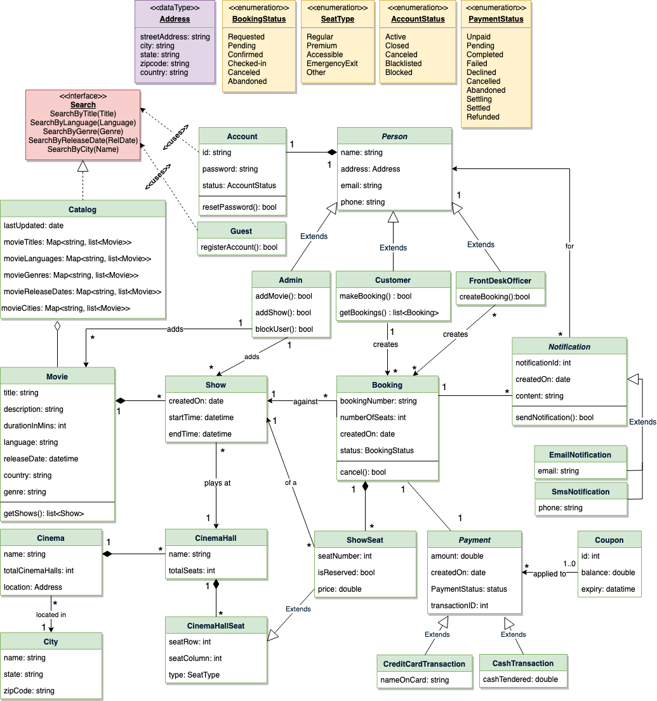
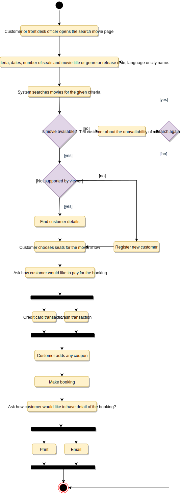
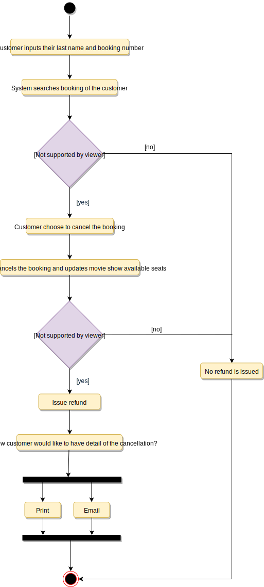

# Designing a Movie Ticket Booking System

An online movie ticket booking system facilitates the purchasing of movie tickets to its customers. E-ticketing systems allow customers to browse through movies currently playing and book seats, anywhere and anytime.

## Requirements

- It should be able to list the cities where affiliate cinemas are located.
- Each cinema can have multiple halls and each hall can run one movie show at a time.
- Each Movie will have multiple shows.
- Customers should be able to search movies by their title, language, genre, release date, and city name.
- Once the customer selects a movie, the service should display the cinemas running that movie and its available shows.
- The customer should be able to select a show at a particular cinema and book their tickets.
- The service should show the customer the seating arrangement of the cinema hall. The customer should be able to select multiple seats according to their preference.
- The customer should be able to distinguish between available seats and booked ones.
- The system should send notifications whenever there is a new movie, as well as when a booking is made or canceled.
- Customers of our system should be able to pay with credit cards or cash.
- The system should ensure that no two customers can reserve the same seat.
- Customers should be able to add a discount coupon to their payment.

## Use Case Diagram

### Actors

- Admin: Responsible for adding new movies and their shows, canceling any movie or show, blocking/unblocking customers, etc.
- FrontDeskOfficer: Can book/cancel tickets.
- Customer: Can view movie schedules, book, and cancel tickets.
- Guest: All guests can search movies but to book seats they have to become a registered member.
- System: Mainly responsible for sending notifications for new movies, bookings, cancellations, etc.

### Processes

- Search movies: To search movies by title, genre, language, release date, and city name.
- Create/Modify/View booking: To book a movie show ticket, cancel it or view details about the show.
- Make payment for booking: To pay for the booking.
- Add a coupon to the payment: To add a discount coupon to the payment.
- Assign Seat: Customers will be shown a seat map to let them select seats for their booking.
- Refund payment: Upon cancellation, customers will be refunded the payment amount as long as the cancellation occurs within the allowed time frame.


## Class Diagram

- Account: Admin will be able to add/remove movies and shows, as well as block/unblock accounts. Customers can search for movies and make bookings for shows. FrontDeskOffice can book tickets for movie shows.
- Guest: Guests can search and view movies descriptions. To make a booking for a show they have to become a registered member.
- Cinema: The main part of the organization for which this software has been designed. It has attributes like ‘name’ to distinguish it from other cinemas.
- CinemaHall: Each cinema will have multiple halls containing multiple seats.
- City: Each city can have multiple cinemas.
- Movie: The main entity of the system. Movies have attributes like title, description, language, genre, release date, city name, etc.
- Show: Each movie can have many shows; each show will be played in a cinema hall.
- CinemaHallSeat: Each cinema hall will have many seats.
- ShowSeat: Each ShowSeat will correspond to a movie Show and a CinemaHallSeat. Customers will make a booking against a ShowSeat.
- Booking: A booking is against a movie show and has attributes like a unique booking number, number of seats, and status.
- Payment: Responsible for collecting payments from customers.
- Notification: Will take care of sending notifications to customers.




## Activity Diagram

### Make Booking



### Cancel Booking



## Code

### Constants and Enums

```java
public enum BookingStatus {
  REQUESTED, PENDING, CONFIRMED, CHECKED_IN, CANCELED, ABANDONED
}

public enum SeatType {
  REGULAR, PREMIUM, ACCESSIBLE, SHIPPED, EMERGENCY_EXIT, OTHER
}

public enum AccountStatus {
  ACTIVE, BLOCKED, BANNED, COMPROMISED, ARCHIVED, UNKNOWN
}

public enum PaymentStatus {
  UNPAID, PENDING, COMPLETED, FILLED, DECLINED, CANCELLED, ABANDONED, SETTLING, SETTLED, REFUNDED
}

public class Address {
  private String streetAddress;
  private String city;
  private String state;
  private String zipCode;
  private String country;
}
```

### Account, Customer, Admin, FrontDeskOfficer, and Guest

```java
// For simplicity, we are not defining getter and setter functions. The reader can
// assume that all class attributes are private and accessed through their respective
// public getter method and modified only through their public setter method.

public class Account {
  private String id;
  private String password;
  private AccountStatus status;

  public boolean resetPassword();
}

public abstract class Person {
  private String name;
  private Address address;
  private String email;
  private String phone;

  private Account account;
}

public class Customer extends Person {
  public boolean makeBooking(Booking booking);
  public List<Booking> getBookings();
}

public class Admin extends Person {
  public boolean addMovie(Movie movie);
  public boolean addShow(Show show);
  public boolean blockUser(Customer customer);
}

public class FrontDeskOfficer extends Person {
  public boolean createBooking(Booking booking);
}

public class Guest {
  public bool registerAccount();
}
```

### Show and Movie

```java
public class Show {
  private int showId;
  private Date createdOn;
  private Date startTime;
  private Date endTime;
  private CinemaHall playedAt;
  private Movie movie;
}

public class Movie {
  private String title;
  private String description;
  private int durationInMins;
  private String language;
  private Date releaseDate;
  private String country;
  private String genre;
  private Admin movieAddedBy;

  private List<Show> shows;
  public List<Show> getShows();
}
```

### Booking, ShowSeat, and Payment

```java
public class Booking {
  private String bookingNumber;
  private int numberOfSeats;
  private Date createdOn;
  private BookingStatus status;

  private Show show;
  private List<ShowSeat> seats;
  private Payment payment;

  public boolean makePayment(Payment payment);
  public boolean cancel();
  public boolean assignSeats(List<ShowSeat> seats);
}

public class ShowSeat extends CinemaHallSeat{
  private int showSeatId;
  private boolean isReserved;
  private double price;
}

public class Payment {
  private double amount;
  private Date createdOn;
  private int transactionId;
  private PaymentStatus status;
}
```

### City, Cinema, and CinemaHall

```java
public class City {
  private String name;
  private String state;
  private String zipCode;
}

public class Cinema {
  private String name;
  private int totalCinemaHalls;
  private Address location;

  private List<CinemaHall> halls;
}

public class CinemaHall {
  private String name;
  private int totalSeats;

  private List<CinemaHallSeat> seats;
  private List<Show> shows;
}
```

### Search Interface and Catalog

```java
public interface Search {
  public List<Movie> searchByTitle(String title);
  public List<Movie> searchByLanguage(String language);
  public List<Movie> searchByGenre(String genre);
  public List<Movie> searchByReleaseDate(Date relDate);
  public List<Movie> searchByCity(String cityName);
}

public class Catalog implements Search {
   HashMap<String, List<Movie>> movieTitles;
   HashMap<String, List<Movie>> movieLanguages;
   HashMap<String, List<Movie>> movieGenres;
   HashMap<Date, List<Movie>> movieReleaseDates;
   HashMap<String, List<Movie>> movieCities;

  public List<Movie> searchByTitle(String title) {
    return movieTitles.get(title);
  }

  public List<Movie> searchByLanguage(String language) {
    return movieLanguages.get(language);
  }

  //...

  public List<Movie> searchByCity(String cityName) {
    return movieCities.get(cityName);
  }
}
```

## Concurrency

How to handle concurrency; such that no two users are able to book the same seat? We can use transactions in SQL databases to avoid any clashes. For example, if we are using SQL server we can utilize Transaction Isolation Levels to lock the rows before we update them. Note: within a transaction, if we read rows we get a write-lock on them so that they can’t be updated by anyone else. Here is the sample code:

```
SET TRANSACTION ISOLATION LEVEL SERIALIZABLE;

BEGIN TRANSACTION;

    -- Suppose we intend to reserve three seats (IDs: 54, 55, 56) for ShowID=99 
    Select * From ShowSeat where ShowID=99 && ShowSeatID in (54, 55, 56) && isReserved=0 

    -- if the number of rows returned by the above statement is NOT three, we can return failure to the user.
    update ShowSeat table...
    update Booking table ...

COMMIT TRANSACTION;
```

‘Serializable’ is the highest isolation level and guarantees safety from Dirty, Nonrepeatable, and Phantoms reads.

Once the above database transaction is successful, we can safely assume that the reservation has been marked successfully and no two customers will be able to reserve the same seat.

Here is the sample Java code:

```java
import java.sql.DriverManager;
import java.sql.Connection;
import java.sql.PreparedStatement;
import java.sql.SQLException;
import java.sql.ResultSet;

public class Customer extends Person {

  public boolean makeBooking(Booking booking) {
    List<ShowSeat> seats = booking.getSeats();
    Integer seatIds[] = new Integer[seats.size()];
    int index = 0;
    for(ShowSeat seat : seats) {
      seatIds[index++] = seat.getShowSeatId();
    }

    Connection dbConnection = null;
    try {
      dbConnection = getDBConnection();
      dbConnection.setAutoCommit(false);
      // ‘Serializable’ is the highest isolation level and guarantees safety from
      // Dirty, Nonrepeatable, and Phantoms reads
      dbConnection.setTransactionIsolation(Connection.TRANSACTION_SERIALIZABLE);

      Statement st = dbConnection.createStatement();
      String selectSQL = "Select * From ShowSeat where ShowID=? && ShowSeatID in (?) && isReserved=0";
      PreparedStatement preparedStatement = dbConnection.prepareStatement(selectSQL);
      preparedStatement.setInt(1, booking.getShow().getShowId());
      Array array = dbConnection.createArrayOf("INTEGER", seatIds);
      preparedStatement.setArray(2, array);

      ResultSet rs = preparedStatement.executeQuery();
      // With TRANSACTION_SERIALIZABLE all the read rows will have the write lock, so we can
      // safely assume that no one else is modifying them.
      if (rs.next()) {
        rs.last(); // move to the last row, to calculate the row count
        int rowCount = rs.getRow();
        // check if we have expected number of rows, if not, this means another process is
        // trying to process at least one of the same row, if that is the case we
        // should not process this booking.
        if(rowCount == seats.size()) {
          // update ShowSeat table...
          // update Booking table ...
          dbConnection.commit();
          return true;
        }
      }
    } catch (SQLException e) {
      dbConnection.rollback();
      System.out.println(e.getMessage());
    }
    return false;
  }
}
```
