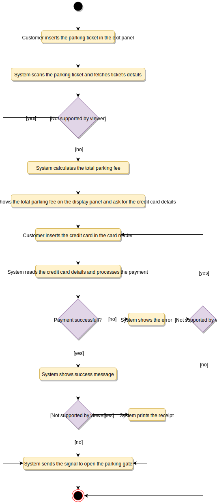

# Designing a Parking Lot

A parking lot or car park is a dedicated cleared area that is intended for parking vehicles. In most countries where cars are a major mode of transportation, parking lots are a feature of every city and suburban area. Shopping malls, sports stadiums, megachurches, and similar venues often feature parking lots over large areas.

## Requirements

- The parking lot should have multiple floors where customers can park their cars.
- The parking lot should have multiple entry and exit points.
- Customers can collect a parking ticket from the entry points and can pay the parking fee at the exit points on their way out.
- Customers can pay the tickets at the automated exit panel or to the parking attendant.
- Customers can pay via both cash and credit cards.
- Customers should also be able to pay the parking fee at the customer’s info portal on each floor. If the customer has paid at the info portal, they don’t have to pay at the exit.
- The system should not allow more vehicles than the maximum capacity of the parking lot. If the parking is full, the system should be able to show a message at the entrance panel and on the parking display board on the ground floor.
- Each parking floor will have many parking spots. The system should support multiple types of parking spots such as Compact, Large, Handicapped, Motorcycle, etc.
- The Parking lot should have some parking spots specified for electric cars. These spots should have an electric panel through which customers can pay and charge their vehicles.
- The system should support parking for different types of vehicles like car, truck, van, motorcycle, etc.
- Each parking floor should have a display board showing any free parking spot for each spot type.
- The system should support a per-hour parking fee model. For example, customers have to pay $4 for the first hour, $3.5 for the second and third hours, and $2.5 for all the remaining hours.

## Use Case Diagram

### Actors

- Admin: Mainly responsible for adding and modifying parking floors, parking spots, entrance, and exit panels, adding/removing parking attendants, etc.
- Customer: All customers can get a parking ticket and pay for it.
- Parking attendant: Parking attendants can do all the activities on the customer’s behalf, and can take cash for ticket payment.
- System: To display messages on different info panels, as well as assigning and removing a vehicle from a parking spot.

### Processes

- Add/Remove/Edit parking floor: To add, remove or modify a parking floor from the system. Each floor can have its own display board to show free parking spots.
- Add/Remove/Edit parking spot: To add, remove or modify a parking spot on a parking floor.
- Add/Remove a parking attendant: To add or remove a parking attendant from the system.
- Take ticket: To provide customers with a new parking ticket when entering the parking lot.
- Scan ticket: To scan a ticket to find out the total charge.
- Credit card payment: To pay the ticket fee with credit card.
- Cash payment: To pay the parking ticket through cash.
- Add/Modify parking rate: To allow admin to add or modify the hourly parking rate.


## Class Diagram

- ParkingLot: The central part of the organization for which this software has been designed. It has attributes like ‘Name’ to distinguish it from any other parking lots and ‘Address’ to define its location.
- ParkingFloor: The parking lot will have many parking floors.
- ParkingSpot: Each parking floor will have many parking spots. Our system will support different parking spots 1) Handicapped, 2) Compact, 3) Large, 4) Motorcycle, and 5) Electric.
- Account: We will have two types of accounts in the system: one for an Admin, and the other for a parking attendant.
- Parking ticket: This class will encapsulate a parking ticket. Customers will take a ticket when they enter the parking lot.
- Vehicle: Vehicles will be parked in the parking spots. Our system will support different types of vehicles 1) Car, 2) Truck, 3) Electric, 4) Van and 5) Motorcycle.
- EntrancePanel and ExitPanel: EntrancePanel will print tickets, and ExitPanel will facilitate payment of the ticket fee.
- Payment: This class will be responsible for making payments. The system will support credit card and cash transactions.
- ParkingRate: This class will keep track of the hourly parking rates. It will specify a dollar amount for each hour. For example, for a two hour parking ticket, this class will define the cost for the first and the second hour.
- ParkingDisplayBoard: Each parking floor will have a display board to show available parking spots for each spot type. This class will be responsible for displaying the latest availability of free parking spots to the customers.
- ParkingAttendantPortal: This class will encapsulate all the operations that an attendant can perform, like scanning tickets and processing payments.
- CustomerInfoPortal: This class will encapsulate the info portal that customers use to pay for the parking ticket. Once paid, the info portal will update the ticket to keep track of the payment.
- ElectricPanel: Customers will use the electric panels to pay and charge their electric vehicles.


## Activity Diagram

### Pay for Parking Ticket



## Code

### Constants and Enums

```java
public enum VehicleType {
  CAR, TRUCK, ELECTRIC, VAN, MOTORBIKE
}

public enum ParkingSpotType {
  HANDICAPPED, COMPACT, LARGE, MOTORBIKE, ELECTRIC
}

public enum AccountStatus {
  ACTIVE, BLOCKED, BANNED, COMPROMISED, ARCHIVED, UNKNOWN
}

public enum ParkingTicketStatus {
  ACTIVE, PAID, LOST
}

public class Address {
  private String streetAddress;
  private String city;
  private String state;
  private String zipCode;
  private String country;
}

public class Person {
  private String name;
  private Address address;
  private String email;
  private String phone;
}
```

### Account, Admin, and ParkingAttendant

```java
// For simplicity, we are not defining getter and setter functions. The reader can
// assume that all class attributes are private and accessed through their respective
// public getter methods and modified only through their public methods function.

public abstract class Account {
  private String userName;
  private String password;
  private AccountStatus status;
  private Person person;

  public boolean resetPassword();
}

public class Admin extends Account {
  public bool addParkingFloor(ParkingFloor floor);
  public bool addParkingSpot(String floorName, ParkingSpot spot);
  public bool addParkingDisplayBoard(String floorName, ParkingDisplayBoard displayBoard);
  public bool addCustomerInfoPanel(String floorName, CustomerInfoPanel infoPanel);

  public bool addEntrancePanel(EntrancePanel entrancePanel);
  public bool addExitPanel(ExitPanel exitPanel);
}

public class ParkingAttendant extends Account {
  public bool processTicket(string TicketNumber);
}
```

### ParkingSpot

```java
public abstract class ParkingSpot {
  private String number;
  private boolean free;
  private Vehicle vehicle;
  private final ParkingSpotType type;

  public boolean IsFree();

  public ParkingSpot(ParkingSpotType type) {
    this.type = type;
  }

  public boolean assignVehicle(Vehicle vehicle) {
    this.vehicle = vehicle;
    free = false;
  }

  public boolean removeVehicle() {
    this.vehicle = null;
    free = true;
  }
}

public class HandicappedSpot extends ParkingSpot {
  public HandicappedSpot() {
    super(ParkingSpotType.HANDICAPPED);
  }
}

public class CompactSpot extends ParkingSpot {
  public CompactSpot() {
    super(ParkingSpotType.COMPACT);
  }
}

public class LargeSpot extends ParkingSpot {
  public LargeSpot() {
    super(ParkingSpotType.LARGE);
  }
}

public class MotorbikeSpot extends ParkingSpot {
  public MotorbikeSpot() {
    super(ParkingSpotType.MOTORBIKE);
  }
}

public class ElectricSpot extends ParkingSpot {
  public ElectricSpot() {
    super(ParkingSpotType.ELECTRIC);
  }
}
```

### Vehicle

```java
public abstract class Vehicle {
  private String licenseNumber;
  private final VehicleType type;
  private ParkingTicket ticket;

  public Vehicle(VehicleType type) {
    this.type = type;
  }

  public void assignTicket(ParkingTicket ticket) {
    this.ticket = ticket;
  }
}

public class Car extends Vehicle {
  public Car() {
    super(VehicleType.CAR);
  }
}

public class Van extends Vehicle {
  public Van() {
    super(VehicleType.VAN);
  }
}

public class Truck extends Vehicle {
  public Truck() {
    super(VehicleType.TRUCK);
  }
}

// Similarly we can define classes for Motorcycle and Electric vehicles
```

### ParkingFloor

```java
public class ParkingFloor {
  private String name;
  private HashMap<String, HandicappedSpot> handicappedSpots;
  private HashMap<String, CompactSpot> compactSpots;
  private HashMap<String, LargeSpot> largeSpots;
  private HashMap<String, MotorbikeSpot> motorbikeSpots;
  private HashMap<String, ElectricSpot> electricSpots;
  private HashMap<String, CustomerInfoPortal> infoPortals;
  private ParkingDisplayBoard displayBoard;

  public ParkingFloor(String name) {
    this.name = name;
  }

  public void addParkingSpot(ParkingSpot spot) {
    switch (spot.getType()) {
    case ParkingSpotType.HANDICAPPED:
      handicappedSpots.put(spot.getNumber(), spot);
      break;
    case ParkingSpotType.COMPACT:
      compactSpots.put(spot.getNumber(), spot);
      break;
    case ParkingSpotType.LARGE:
      largeSpots.put(spot.getNumber(), spot);
      break;
    case ParkingSpotType.MOTORBIKE:
      motorbikeSpots.put(spot.getNumber(), spot);
      break;
    case ParkingSpotType.ELECTRIC:
      electricSpots.put(spot.getNumber(), spot);
      break;
    default:
      print("Wrong parking spot type!");
    }
  }

  public void assignVehicleToSpot(Vehicle vehicle, ParkingSpot spot) {
    spot.assignVehicle(vehicle);
    switch (spot.getType()) {
    case ParkingSpotType.HANDICAPPED:
      updateDisplayBoardForHandicapped(spot);
      break;
    case ParkingSpotType.COMPACT:
      updateDisplayBoardForCompact(spot);
      break;
    case ParkingSpotType.LARGE:
      updateDisplayBoardForLarge(spot);
      break;
    case ParkingSpotType.MOTORBIKE:
      updateDisplayBoardForMotorbike(spot);
      break;
    case ParkingSpotType.ELECTRIC:
      updateDisplayBoardForElectric(spot);
      break;
    default:
      print("Wrong parking spot type!");
    }
  }

  private void updateDisplayBoardForHandicapped(ParkingSpot spot) {
    if (this.displayBoard.getHandicappedFreeSpot().getNumber() == spot.getNumber()) {
      // find another free handicapped parking and assign to displayBoard
      for (String key : handicappedSpots.keySet()) {
        if (handicappedSpots.get(key).isFree()) {
          this.displayBoard.setHandicappedFreeSpot(handicappedSpots.get(key));
        }
      }
      this.displayBoard.showEmptySpotNumber();
    }
  }

  private void updateDisplayBoardForCompact(ParkingSpot spot) {
    if (this.displayBoard.getCompactFreeSpot().getNumber() == spot.getNumber()) {
      // find another free compact parking and assign to displayBoard
      for (String key : compactSpots.keySet()) {
        if (compactSpots.get(key).isFree()) {
          this.displayBoard.setCompactFreeSpot(compactSpots.get(key));
        }
      }
      this.displayBoard.showEmptySpotNumber();
    }
  }

  public void freeSpot(ParkingSpot spot) {
    spot.removeVehicle();
    switch (spot.getType()) {
    case ParkingSpotType.HANDICAPPED:
      freeHandicappedSpotCount++;
      break;
    case ParkingSpotType.COMPACT:
      freeCompactSpotCount++;
      break;
    case ParkingSpotType.LARGE:
      freeLargeSpotCount++;
      break;
    case ParkingSpotType.MOTORBIKE:
      freeMotorbikeSpotCount++;
      break;
    case ParkingSpotType.ELECTRIC:
      freeElectricSpotCount++;
      break;
    default:
      print("Wrong parking spot type!");
    }
  }
}
```

### ParkingDisplayBoard

```java
public class ParkingDisplayBoard {
  private String id;
  private HandicappedSpot handicappedFreeSpot;
  private CompactSpot compactFreeSpot;
  private LargeSpot largeFreeSpot;
  private MotorbikeSpot motorbikeFreeSpot;
  private ElectricSpot electricFreeSpot;

  public void showEmptySpotNumber() {
    String message = "";
    if(handicappedFreeSpot.IsFree()){
      message += "Free Handicapped: " + handicappedFreeSpot.getNumber();
    } else {
      message += "Handicapped is full";
    }
    message += System.lineSeparator();

    if(compactFreeSpot.IsFree()){
      message += "Free Compact: " + compactFreeSpot.getNumber();
    } else {
      message += "Compact is full";
    }
    message += System.lineSeparator();

    if(largeFreeSpot.IsFree()){
      message += "Free Large: " + largeFreeSpot.getNumber();
    } else {
      message += "Large is full";
    }
    message += System.lineSeparator();

    if(motorbikeFreeSpot.IsFree()){
      message += "Free Motorbike: " + motorbikeFreeSpot.getNumber();
    } else {
      message += "Motorbike is full";
    }
    message += System.lineSeparator();

    if(electricFreeSpot.IsFree()){
      message += "Free Electric: " + electricFreeSpot.getNumber();
    } else {
      message += "Electric is full";
    }

    Show(message);
  }
}
```

### ParkingLot

```java
public class ParkingLot {
  private String name;
  private Location address;
  private ParkingRate parkingRate;

  private int compactSpotCount;
  private int largeSpotCount;
  private int motorbikeSpotCount;
  private int electricSpotCount;
  private final int maxCompactCount;
  private final int maxLargeCount;
  private final int maxMotorbikeCount;
  private final int maxElectricCount;

  private HashMap<String, EntrancePanel> entrancePanels;
  private HashMap<String, ExitPanel> exitPanels;
  private HashMap<String, ParkingFloor> parkingFloors;

  // all active parking tickets, identified by their ticketNumber
  private HashMap<String, ParkingTicket> activeTickets;

  // singleton ParkingLot to ensure only one object of ParkingLot in the system,
  // all entrance panels will use this object to create new parking ticket: getNewParkingTicket(),
  // similarly exit panels will also use this object to close parking tickets
  private static ParkingLot parkingLot = null;

  // private constructor to restrict for singleton
  private ParkingLot() {
    // 1. initialize variables: read name, address and parkingRate from database
    // 2. initialize parking floors: read the parking floor map from database,
    //  this map should tell how many parking spots are there on each floor. This
    //  should also initialize max spot counts too.
    // 3. initialize parking spot counts by reading all active tickets from database
    // 4. initialize entrance and exit panels: read from database
  }

  // static method to get the singleton instance of ParkingLot
  public static ParkingLot getInstance() {
    if (parkingLot == null) {
      parkingLot = new ParkingLot();
    }
    return parkingLot;
  }

  // note that the following method is 'synchronized' to allow multiple entrances
  // panels to issue a new parking ticket without interfering with each other
  public synchronized ParkingTicket getNewParkingTicket(Vehicle vehicle) throws ParkingFullException {
    if (this.isFull(vehicle.getType())) {
      throw new ParkingFullException();
    }
    ParkingTicket ticket = new ParkingTicket();
    vehicle.assignTicket(ticket);
    ticket.saveInDB();
    // if the ticket is successfully saved in the database, we can increment the parking spot count
    this.incrementSpotCount(vehicle.getType());
    this.activeTickets.put(ticket.getTicketNumber(), ticket);
    return ticket;
  }

  public boolean isFull(VehicleType type) {
    // trucks and vans can only be parked in LargeSpot
    if (type == VehicleType.Truck || type == VehicleType.Van) {
      return largeSpotCount >= maxLargeCount;
    }

    // motorbikes can only be parked at motorbike spots
    if (type == VehicleType.Motorbike) {
      return motorbikeSpotCount >= maxMotorbikeCount;
    }

    // cars can be parked at compact or large spots
    if (type == VehicleType.Car) {
      return (compactSpotCount + largeSpotCount) >= (maxCompactCount + maxLargeCount);
    }

    // electric car can be parked at compact, large or electric spots
    return (compactSpotCount + largeSpotCount + electricSpotCount) >= (maxCompactCount + maxLargeCount
        + maxElectricCount);
  }

  // increment the parking spot count based on the vehicle type
  private boolean incrementSpotCount(VehicleType type) {
    if (type == VehicleType.Truck || type == VehicleType.Van) {
      largeSpotCount++;
    } else if (type == VehicleType.Motorbike) {
      motorbikeSpotCount++;
    } else if (type == VehicleType.Car) {
      if (compactSpotCount < maxCompactCount) {
        compactSpotCount++;
      } else {
        largeSpotCount++;
      }
    } else { // electric car
      if (electricSpotCount < maxElectricCount) {
        electricSpotCount++;
      } else if (compactSpotCount < maxCompactCount) {
        compactSpotCount++;
      } else {
        largeSpotCount++;
      }
    }
  }

  public boolean isFull() {
    for (String key : parkingFloors.keySet()) {
      if (!parkingFloors.get(key).isFull()) {
        return false;
      }
    }
    return true;
  }

  public void addParkingFloor(ParkingFloor floor) {
    /* store in database */ }

  public void addEntrancePanel(EntrancePanel entrancePanel) {
    /* store in database */ }

  public void addExitPanel(ExitPanel exitPanel) {
    /* store in database */ }
}
```
