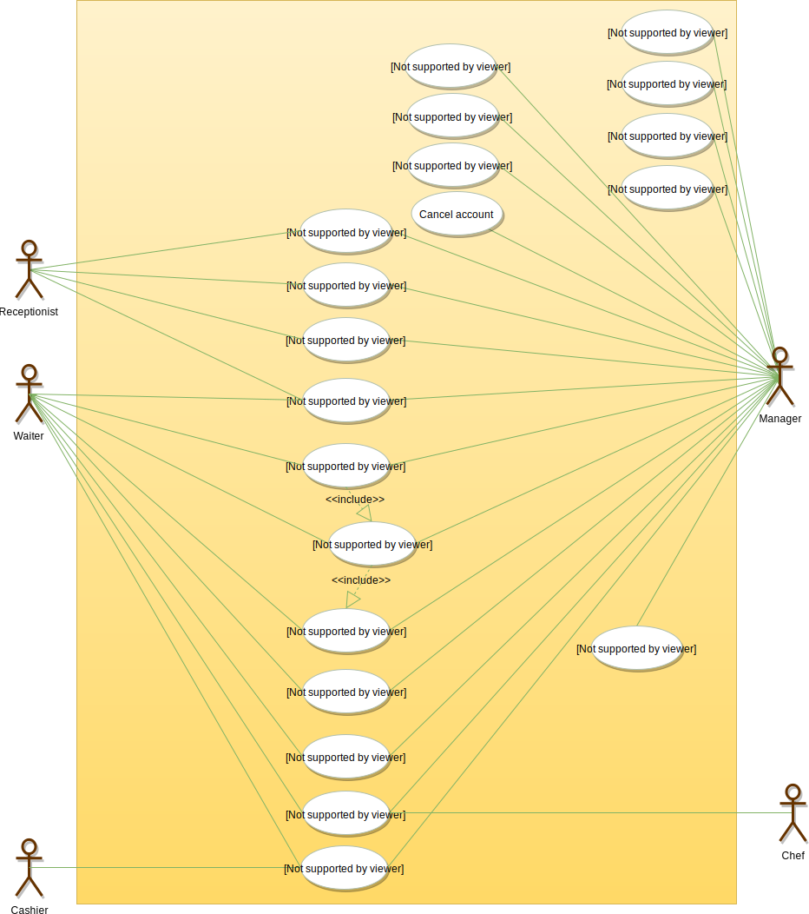
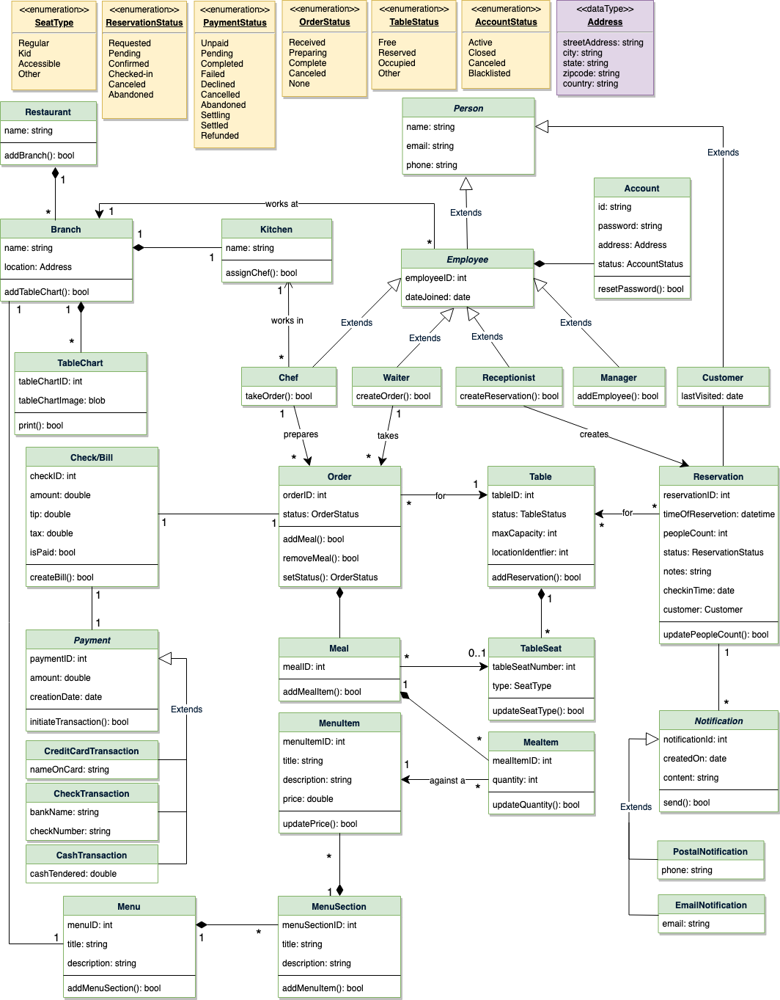
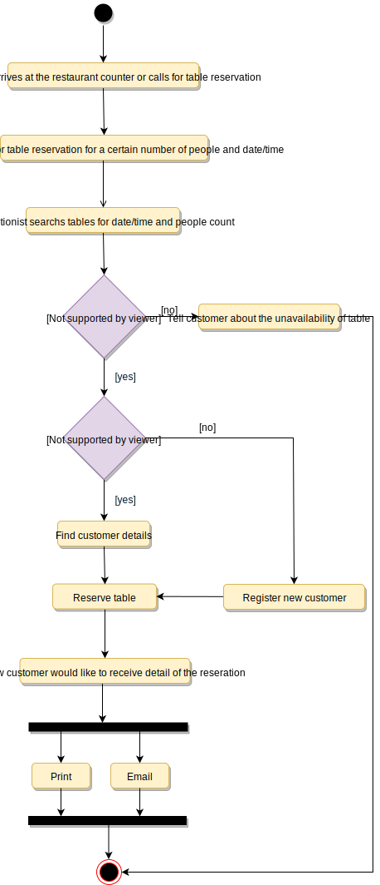
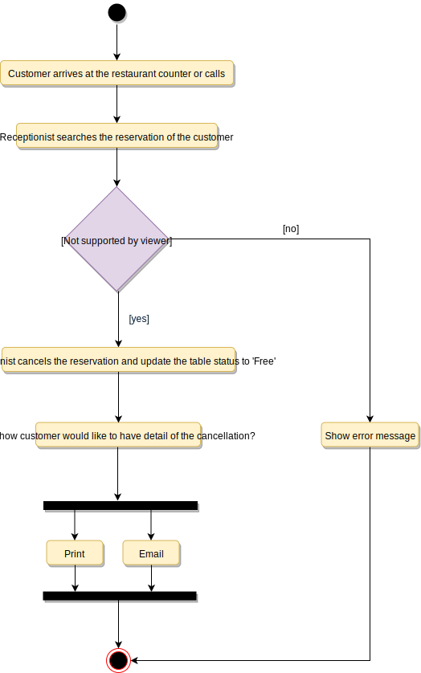

# Designing a Restaurant Management system

A Restaurant Management System is a software built to handle all restaurant activities in an easy and safe manner. This System will give the Restaurant management power and flexibility to manage the entire system from a single portal. The system allows the manager to keep track of available tables in the system as well as the reservation of tables and bill generation.

## Requirements

- The restaurant will have different branches.
- Each restaurant branch will have a menu.
- The menu will have different menu sections, containing different menu items.
- The waiter should be able to create an order for a table and add meals for each seat.
- Each meal can have multiple meal items. Each meal item corresponds to a menu item.
- The system should be able to retrieve information about tables currently available to seat walk-in customers.
- The system should support the reservation of tables.
- The receptionist should be able to search for available tables by date/time and reserve a table.
- The system should allow customers to cancel their reservation.
- The system should be able to send notifications whenever the reservation time is approaching.
- The customers should be able to pay their bills through credit card, check or cash.
- Each restaurant branch can have multiple seating arrangements of tables.

## Use Case Diagram

### Actors

- Receptionist: Mainly responsible for adding and modifying tables and their layout, and creating and canceling table reservations.
- Waiter: To take/modify orders.
- Manager: Mainly responsible for adding new workers and modifying the menu.
- Chef: To view and work on an order.
- Cashier: To generate checks and process payments.
- System: Mainly responsible for sending notifications about table reservations, cancellations, etc.

### Processes

- Add/Modify tables: To add, remove, or modify a table in the system.
- Search tables: To search for available tables for reservation.
- Place order: Add a new order in the system for a table.
- Update order: Modify an already placed order, which can include adding/modifying meals or meal items.
- Create a reservation: To create a table reservation for a certain date/time for an available table.
- Cancel reservation: To cancel an existing reservation.
- Check-in: To let the guest check in for their reservation.
- Make payment: Pay the check for the food.



## Class Diagram

- Restaurant: This class represents a restaurant. Each restaurant has registered employees. The employees are part of the restaurant because if the restaurant becomes inactive, all its employees will automatically be deactivated.
- Branch: Any restaurants can have multiple branches. Each branch will have its own set of employees and menus.
- Menu: All branches will have their own menu.
- MenuSection and MenuItem: A menu has zero or more menu sections. Each menu section consists of zero or more menu items.
- Table and TableSeat: The basic building block of the system. Every table will have a unique identifier, maximum sitting capacity, etc. Each table will have multiple seats.
- Order: This class encapsulates the order placed by a customer.
- Meal: Each order will consist of separate meals for each table seat.
- Meal Item: Each Meal will consist of one or more meal items corresponding to a menu item.
- Account: We’ll have different types of accounts in the system, one will be a receptionist to search and reserve tables and the other, the waiter will place orders in the system.
- Notification: Will take care of sending notifications to customers.
- Bill: Contains different bill-items for every meal item.




## Activity Diagram

### Place Order


### Make Reservation



### Cancel Reservation



## Code

### Constants and Enums

```java
public enum ReservationStatus {
  REQUESTED, PENDING, CONFIRMED, CHECKED_IN, CANCELED, ABANDONED
}

public enum SeatType {
  REGULAR, KID, ACCESSIBLE, OTHER
}

public enum OrderStatus {
  RECEIVED, PREPARING, COMPLETED, CANCELED, NONE
}

public enum TableStatus {
  FREE, RESERVED, OCCUPIED, OTHER
}

public enum AccountStatus {
  ACTIVE, CLOSED, CANCELED, BLACKLISTED, BLOCKED
}

public enum PaymentStatus {
  UNPAID, PENDING, COMPLETED, FILLED, DECLINED, CANCELLED, ABANDONED, SETTLING, SETTLED, REFUNDED
}

public class Address {
  private String streetAddress;
  private String city;
  private String state;
  private String zipCode;
  private String country;
}
```

### Account, Person, Employee, Receptionist, Manager, and Chef

```java
// For simplicity, we are not defining getter and setter functions. The reader can
// assume that all class attributes are private and accessed through their respective
// public getter methods and modified only through their public setter function.

public class Account {
  private String id;
  private String password;
  private Address address;
  private AccountStatus status;

  public boolean resetPassword();
}

public abstract class Person {
  private String name;
  private String email;
  private String phone; 
}


public abstract class Employee extends Person {
  private int employeeID;
  private Date dateJoined;
  
  private Account account;
}

public class Receptionist extends Employee {
  public boolean createReservation();
  public List<Customer> searchCustomer(String name);
}

public class Manager extends Employee {
  public boolean addEmployee();
}

public class Chef extends Employee {
  public boolean takeOrder();
}
```

### Restaurant, Branch, Kitchen, TableChart

```java
public class Kitchen {
  private String name;
  private Chef[] chefs;

  private boolean assignChef();
}

public class Branch {
  private String name;
  private Address location;
  private Kitchen kitchen;

  public Address addTableChart();
}

public class Restaurant {
  private String name;
  private List<Branch> branches;

  public boolean addBranch(Branch branch);
}

public class TableChart {
  private int tableChartID;
  private byte[] tableChartImage;

  public bool print();
}
```

### Table, TableSeat, and Reservation

```java
public class Table {
  private int tableID;
  private TableStatus status;
  private int maxCapacity;
  private int locationIdentifier;

  private List<TableSeat> seats;

  public boolean isTableFree();
  public boolean addReservation();

  public static List<Table> search(int capacity, Date startTime) {
    // return all tables with the given capacity and availability
  }
}

public class TableSeat {
  private int tableSeatNumber;
  private SeatType type;

  public boolean updateSeatType(SeatType type);
}

public class Reservation {
  private int reservationID;
  private Date timeOfReservation;
  private int peopleCount;
  private ReservationStatus status;
  private String notes;
  private Date checkinTime;
  private Customer customer;

  private Table[] tables;
  private List<Notification> notifications;
  public boolean updatePeopleCount(int count);
}
```

### Menu, MenuSection, and MenuItem

```java
public class MenuItem {
  private int menuItemID;
  private String title;
  private String description;
  private double price;

  public boolean updatePrice(double price);
}

public class MenuSection {
  private int menuSectionID;
  private String title;
  private String description;
  private List<MenuItem> menuItems;

  public boolean addMenuItem(MenuItem menuItem);
}

public class Menu {
  private int menuID;
  private String title;
  private String description;
  private List<MenuSection> menuSections;

  public boolean addMenuSection(MenuSection menuSection);
  public boolean print();
}
```

### Order, Meal, and MealItem

```java
public class MealItem {
  private int mealItemID;
  private int quantity;
  private MenuItem menuItem;

  public boolean updateQuantity(int quantity);
}

public class Meal {
  private int mealID;
  private TableSeat seat;
  private List<MenuItem> menuItems;

  public boolean addMealItem(MealItem mealItem);
}

public class Order {
  private int OrderID;
  private OrderStatus status;
  private Date creationTime;

  private Meal[] meals;
  private Table table;
  private Check check;
  private Waiter waiter;
  private Chef chef;

  public boolean addMeal(Meal meal);
  public boolean removeMeal(Meal meal);
  public OrderStatus getStatus();
  public boolean setStatus(OrderStatus status);
}
```
