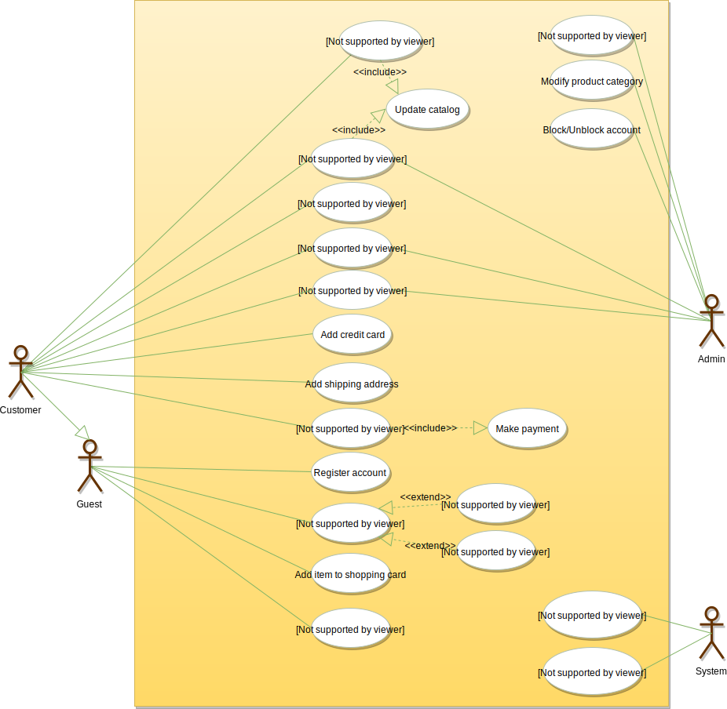

# Designing Amazon

Amazon (amazon.com) is the world’s largest online retailer. The company was originally a bookseller but has expanded to sell a wide variety of consumer goods and digital media. For the sake of this problem, we will focus on their online retail business where users can sell/buy their products.

## Requirements

- Users should be able to add new products to sell.
- Users should be able to search for products by their name or category.
- Users can search and view all the products, but they will have to become a registered member to buy a product.
- Users should be able to add/remove/modify product items in their shopping cart.
- Users can check out and buy items in the shopping cart.
- Users can rate and add a review for a product.
- Users should be able to specify a shipping address where their order will be delivered.
- Users can cancel an order if it has not shipped.
- Users should get notifications whenever there is a change in the order or shipping status.
- Users should be able to pay through credit cards or electronic bank transfer.
- Users should be able to track their shipment to see the current state of their order.

## Use Case Diagram

### Actors

- Admin: Mainly responsible for account management and adding or modifying new product categories.
- Guest: All guests can search the catalog, add/remove items to the shopping cart, as well as become registered members.
- Member: Members can perform all the activities that guests can, in addition to which, they can place orders and add new products to sell.
- System: Mainly responsible for sending notifications for orders and shipping updates.

### Processes

- Add/update products; whenever a product is added or modified, we will update the catalog.
- Search for products by their name or category.
- Add/remove product items in the shopping cart.
- Check-out to buy product items in the shopping cart.
- Make a payment to place an order.
- Add a new product category.
- Send notifications to members with shipment updates.



## Class Diagram

- Account: There are two types of registered accounts in the system: one will be an Admin, who is responsible for adding new product categories and blocking/unblocking members; the other, a Member, who can buy/sell products.
- Guest: Guests can search for and view products, and add them in the shopping cart. To place an order they have to become a registered member.
- Catalog: Users of our system can search for products by their name or category. This class will keep an index of all products for faster search.
- ProductCategory: This will encapsulate the different categories of products, such as books, electronics, etc.
- Product: This class will encapsulate the entity that the users of our system will be buying and selling. Each Product will belong to a ProductCategory.
- ProductReview: Any registered member can add a review about a product.
- ShoppingCart: Users will add product items that they intend to buy to the shopping cart.
- Item: This class will encapsulate a product item that the users will be buying or placing in the shopping cart. For example, a pen could be a product and if there are 10 pens in the inventory, each of these 10 pens will be considered a product item.
- Order: This will encapsulate a buying order to buy everything in the shopping cart.
- OrderLog: Will keep a track of the status of orders, such as unshipped, pending, complete, canceled, etc.
- ShipmentLog: Will keep a track of the status of shipments, such as pending, shipped, delivered, etc.
- Notification: This class will take care of sending notifications to customers.
- Payment: This class will encapsulate the payment for an order. Members can pay through credit card or electronic bank transfer.


## Activity Diagram

### Check Out Shopping Cart


## Sequence Diagram

### Search Catalog


### Add to Shopping Cart


### Check Out Shopping Cart


## Code

### Constants and Enums

```java
public class Address {
  private String streetAddress;
  private String city;
  private String state;
  private String zipCode;
  private String country;
}

public enum OrderStatus {
  UNSHIPPED, PENDING, SHIPPED, COMPLETED, CANCELED, REFUND_APPLIED
}

public enum AccountStatus {
  ACTIVE, BLOCKED, BANNED, COMPROMISED, ARCHIVED, UNKNOWN
}

public enum ShipmentStatus {
  PENDING, SHIPPED, DELIVERED, ON_HOLD,
}

public enum PaymentStatus {
  UNPAID, PENDING, COMPLETED, FILLED, DECLINED, CANCELLED, ABANDONED, SETTLING, SETTLED, REFUNDED
}
```

### Account, Customer, Admin, and Guest

```java
// For simplicity, we are not defining getter and setter functions. The reader can
// assume that all class attributes are private and accessed through their respective
// public getter methods and modified only through their public methods function.

public class Account {
  private String userName;
  private String password;
  private AccountStatus status;
  private String name;
  private Address shippingAddress;
  private String email;
  private String phone;

  private List<CreditCard> creditCards;
  private List<ElectronicBankTransfer> bankAccounts;

  public boolean addProduct(Product product);
  public boolean addProductReview(ProductReview review);
  public boolean resetPassword();
}

public abstract class Customer {
  private ShoppingCart cart;
  private Order order;

  public ShoppingCart getShoppingCart();
  public bool addItemToCart(Item item);
  public bool removeItemFromCart(Item item);
}

public class Guest extends Customer {
  public bool registerAccount();
}

public class Member extends Customer {
  private Account account;
  public OrderStatus placeOrder(Order order);
}
```

### ProductCategory, Product, and ProductReview

```java
public class ProductCategory {
  private String name;
  private String description;
}

public class ProductReview {
  private int rating;
  private String review;

  private Member reviewer;
}

public class Product {
  private String productID;
  private String name;
  private String description;
  private double price;
  private ProductCategory category;
  private int availableItemCount;

  private Account seller;

  public int getAvailableCount();
  public boolean updatePrice(double newPrice);
}
```

### ShoppingCart, Item, Order, and OrderLog

```java
public class Item {
  private String productID;
  private int quantity;
  private double price;

  public boolean updateQuantity(int quantity);
}

public class ShoppingCart {
  private List<Items> items;

  public boolean addItem(Item item);
  public boolean removeItem(Item item);
  public boolean updateItemQuantity(Item item, int quantity);
  public List<Item> getItems();
  public boolean checkout();
}

public class OrderLog {
  private String orderNumber;
  private Date creationDate;
  private OrderStatus status;
}

public class Order {
  private String orderNumber;
  private OrderStatus status;
  private Date orderDate;
  private List<OrderLog> orderLog;

  public boolean sendForShipment();
  public boolean makePayment(Payment payment);
  public boolean addOrderLog(OrderLog orderLog);
}
```

### Shipment, ShipmentLog, and Notification

```java
public class ShipmentLog {
  private String shipmentNumber;
  private ShipmentStatus status;
  private Date creationDate;
}

public class Shipment {
  private String shipmentNumber;
  private Date shipmentDate;
  private Date estimatedArrival;
  private String shipmentMethod;
  private List<ShipmentLog> shipmentLogs;

  public boolean addShipmentLog(ShipmentLog shipmentLog);
}

public abstract class Notification {
  private int notificationId;
  private Date createdOn;
  private String content;

  public boolean sendNotification(Account account);
}
```

### Search Interface and Catalog

```java
public interface Search {
  public List<Product> searchProductsByName(String name);
  public List<Product> searchProductsByCategory(String category);
}

public class Catalog implements Search {
   HashMap<String, List<Product>> productNames;
   HashMap<String, List<Product>> productCategories;

  public List<Product> searchProductsByName(String name) {
    return productNames.get(name);
  }

  public List<Product> searchProductsByCategory(String category) {
    return productCategories.get(category);
  }
}
```
