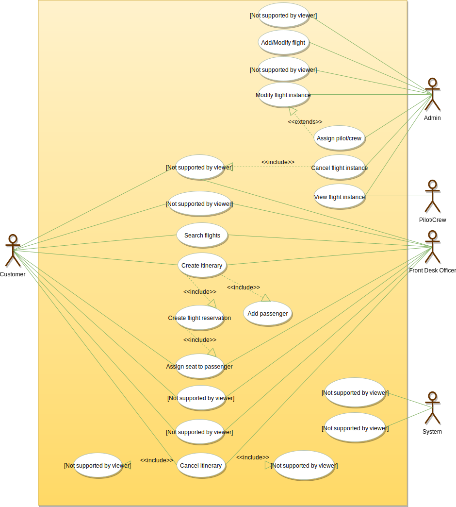
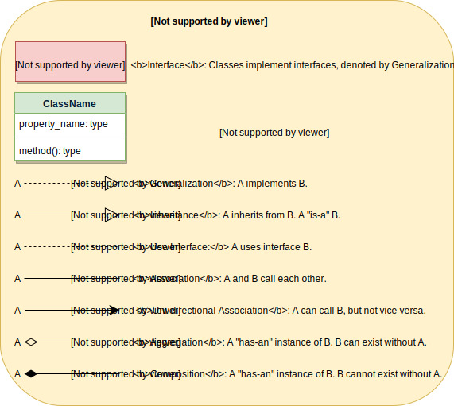
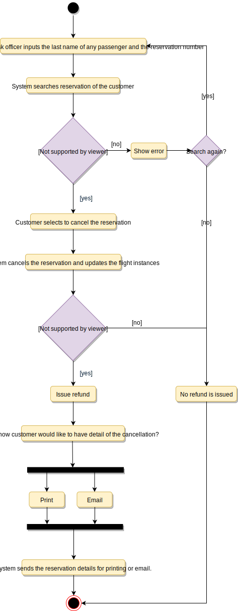

# Designing an Airline Management System

An Airline Management System is a managerial software which targets to control all operations of an airline. Airlines provide transport services for their passengers. They carry or hire aircraft for this purpose. All operations of an airline company are controlled by their airline management system.

This system involves the scheduling of flights, air ticket reservations, flight cancellations, customer support, and staff management. Daily flights updates can also be retrieved by using the system.

## Requirements

- Customers should be able to search for flights for a given date and source/destination airport.
- Customers should be able to reserve a ticket for any scheduled flight. Customers can also build a multi-flight itinerary.
- Users of the system can check flight schedules, their departure time, available seats, arrival time, and other flight details.
- Customers can make reservations for multiple passengers under one itinerary.
- Only the admin of the system can add new aircrafts, flights, and flight schedules. Admin can cancel any pre-scheduled flight (all stakeholders will be notified).
- Customers can cancel their reservation and itinerary.
- The system should be able to handle the assignment of pilots and crew members to flights.
- The system should be able to handle payments for reservations.
- The system should be able to send notifications to customers whenever a reservation is made/modified or there is an update for their flights.

## Use Case Diagram

### Actors

- Admin: Responsible for adding new flights and their schedules, canceling any flight, maintaining staff-related work, etc.
- Front desk officer: Will be able to reserve/cancel tickets.
- Customer: Can view flight schedule, reserve and cancel tickets.
- Pilot/Crew: Can view their assigned flights and their schedules.
- System: Mainly responsible for sending notifications regarding itinerary changes, flight status updates, etc.

### Processes

- Search Flights: To search the flight schedule to find flights for a suitable date and time.
- Create/Modify/View reservation: To reserve a ticket, cancel it, or view details about the flight or ticket.
- Assign seats to passengers: To assign seats to passengers for a flight instance with their reservation.
- Make payment for a reservation: To pay for the reservation.
- Update flight schedule: To make changes in the flight schedule, and to add or remove any flight.
- Assign pilots and crew: To assign pilots and crews to flights.



## Class Diagram

- Airline: The main part of the organization for which this software has been designed. It has attributes like ‘name’ and an airline code to distinguish the airline from other airlines.
- Airport: Each airline operates out of different airports. Each airport has a name, address, and a unique code.
- Aircraft: Airlines own or hire aircraft to carry out their flights. Each aircraft has attributes like name, model, manufacturing year, etc.
- Flight: The main entity of the system. Each flight will have a flight number, departure and arrival airport, assigned aircraft, etc.
- FlightInstance: Each flight can have multiple occurrences; each occurrence will be considered a flight instance in our system. For example, if a British Airways flight from London to Tokyo (flight number: BA212) occurs twice a week, each of these occurrences will be considered a separate flight instance in our system.
- WeeklySchedule and CustomSchedule: Flights can have multiple schedules and each schedule will create a flight instance.
- FlightReservation: A reservation is made against a flight instance and has attributes like a unique reservation number, list of passengers and their assigned seats, reservation status, etc.
- Itinerary: An itinerary can have multiple flights.
- FlightSeat: This class will represent all seats of an aircraft assigned to a specific flight instance. All reservations of this flight instance will assign seats to passengers through this class.
- Payment: Will be responsible for collecting payments from customers.
- Notification: This class will be responsible for sending notifications for flight reservations, flight status update, etc.




## Activity Diagram

### Make Reservation


### Cancel Reservation



## Code

### Constants and Enums

```java
public enum FlightStatus{
  ACTIVE,
  SCHEDULED,
  DELAYED,
  DEPARTED,
  LANDED,
  IN_AIR,
  ARRIVED,
  CANCELLED,
  DIVERTED,
  UNKNOWN
}

public enum PaymentStatus{
  UNPAID,
  PENDING,
  COMPLETED,
  FILLED,
  DECLINED,
  CANCELLED,
  ABANDONED,
  SETTLING,
  SETTLED,
  REFUNDED
}

public enum ReservationStatus{
  REQUESTED,
  PENDING,
  CONFIRMED,
  CHECKED_IN,
  CANCELLED,
  ABANDONED
}

public enum SeatClass {
  ECONOMY,
  ECONOMY_PLUS,
  PREFERRED_ECONOMY,
  BUSINESS,
  FIRST_CLASS
}

public enum SeatType {
  REGULAR,
  ACCESSIBLE,
  EMERGENCY_EXIT,
  EXTRA_LEG_ROOM
}

public enum AccountStatus{
  ACTIVE,
  CLOSED,
  CANCELED,
  BLACKLISTED,
  BLOCKED
}

public class Address {
  private String streetAddress;
  private String city;
  private String state;
  private String zipCode;
  private String country;
}
```

### Account, Person, Customer and Passenger

```java
// For simplicity, we are not defining getter and setter functions. The reader can
// assume that all class attributes are private and accessed through their respective
// public getter method and modified only through their public setter method.

public class Account {
  private String id;
  private String password;
  private AccountStatus status;

  public boolean resetPassword();
}

public abstract class Person {
  private String name;
  private Address address;
  private String email;
  private String phone;

  private Account account;
}

public class Customer extends Person {
  private String frequentFlyerNumber;

  public List<Itinerary> getItineraries();
}

public class Passenger {
  private String name;
  private String passportNumber;
  private Date dateOfBirth;

  public String getPassportNumber() {
    return this.passportNumber;
  }
}
```

### Airport, Aircraft, Seat and FlightSeat

```java
public class Airport {
  private String name;
  private Address address;
  private String code;

  public List<Flight> getFlights();
}

public class Aircraft {
  private String name;
  private String model;
  private int manufacturingYear;
  private List<Seat> seats;

  public List<FlightInstance> getFlights();
}

public class Seat {
  private String seatNumber;
  private SeatType type;
  private SeatClass _class;
}

public class FlightSeat extends Seat {
  private double fare;
  public double getFare();
}
```

### Flight Schedule classes, Flight, FlightInstance, FlightReservation, Itinerary

```java
public class WeeklySchedule {
  private int dayOfWeek;
  private Time departureTime;
}

public class CustomSchedule {
  private Date customDate;
  private Time departureTime;
}

public class Flight {
  private String flightNumber;
  private Airport departure;
  private Airport arrival;
  private int durationInMinutes;

  private List<WeeklySchedules> weeklySchedules;
  private List<CustomSchedules> customSchedules;
  private List<FlightInstance> flightInstances;
}

public class FlightInstance {
  private Date departureTime;
  private String gate;
  private FlightStatus status;
  private Aircraft aircraft;

  public bool cancel();
  public void updateStatus(FlightStatus status);
}

public class FlightReservation {
  private String reservationNumber;
  private FlightInstance flight;
  private Map<Passenger, FlightSeat> seatMap;
  private Date creationDate;
  private ReservationStatus status;

  public static FlightReservation fetchReservationDetails(String reservationNumber);
  public List<Passenger> getPassengers();
}

public class Itinerary {
  private String customerId;
  private Airport startingAirport;
  private Airport finalAirport;
  private Date creationDate;
  private List<FlightReservation> reservations;

  public List<FlightReservation> getReservations();
  public boolean makeReservation();
  public boolean makePayment();
}
```
