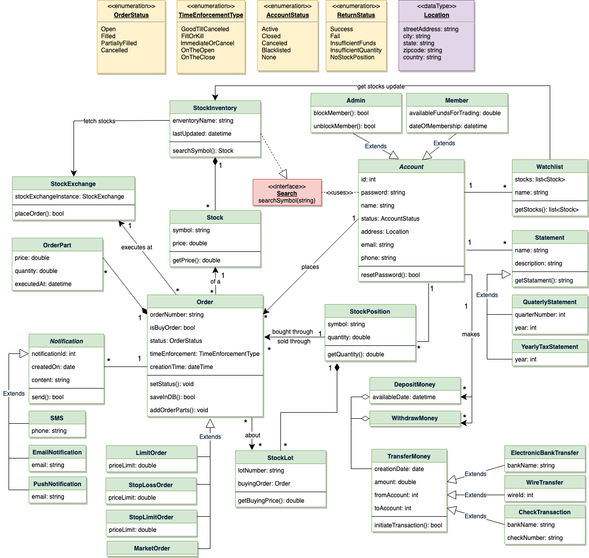
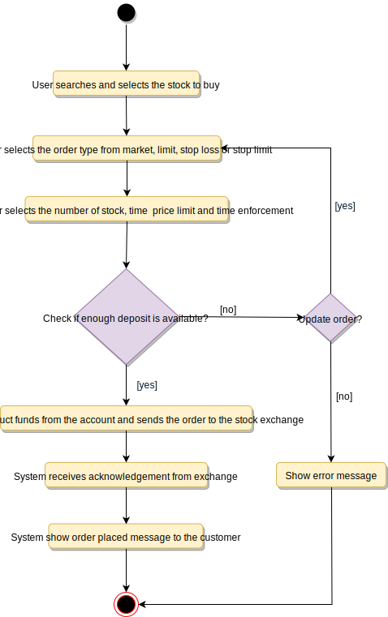
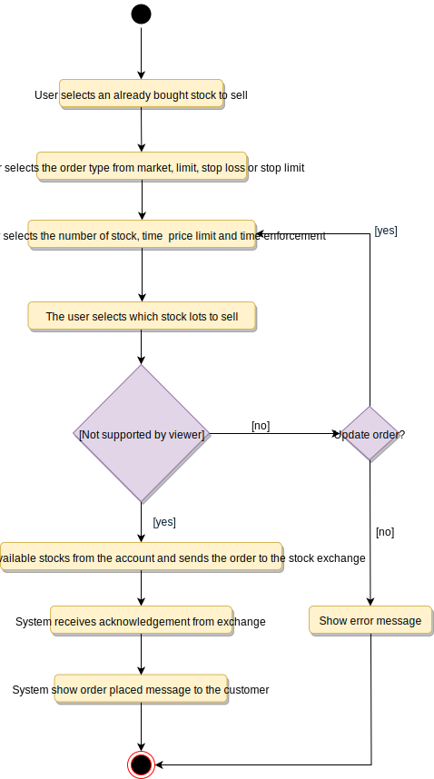

# Designing an Online Stock Brokerage System

An Online Stock Brokerage System facilitates its users the trade (i.e. buying and selling) of stocks online. It allows clients to keep track of and execute their transactions, and shows performance charts of the different stocks in their portfolios. It also provides security for their transactions and alerts them to pre-defined levels of changes in stocks, without the use of any middlemen.

The online stock brokerage system automates traditional stock trading using computers and the internet, making the transaction faster and cheaper. This system also gives speedier access to stock reports, current market trends, and real-time stock prices.

## Requirements

- Any user of our system should be able to buy and sell stocks.
- Any user can have multiple watchlists containing multiple stock quotes.
- Users should be able to place stock trade orders of the following types: 1) market, 2) limit, 3) stop loss and, 4) stop limit.
- Users can have multiple ‘lots’ of a stock. This means that if a user has bought a stock multiple times, the system should be able to differentiate between different lots of the same stock.
- The system should be able to generate reports for quarterly updates and yearly tax statements.
- Users should be able to deposit and withdraw money either via check, wire, or electronic bank transfer.
- The system should be able to send notifications whenever trade orders are executed.

## Use Case Diagram

### Actors

- Admin: Mainly responsible for administrative functions like blocking or unblocking members.
- Member: All members can search the stock inventory, as well as buy and sell stocks. Members can have multiple watchlists containing multiple stock quotes.
- System: Mainly responsible for sending notifications for stock orders and periodically fetching stock quotes from the stock exchange.

### Processes

- Register new account/Cancel membership: To add a new member or cancel the membership of an existing member.
- Add/Remove/Edit watchlist: To add, remove or modify a watchlist.
- Search stock inventory: To search for stocks by their symbols.
- Place order: To place a buy or sell order on the stock exchange.
- Cancel order: Cancel an already placed order.
- Deposit/Withdraw money: Members can deposit or withdraw money via check, wire or electronic bank transfer.


## Class Diagram

- Account: Consists of the member’s name, address, e-mail, phone, total funds, funds that are available for trading, etc. We’ll have two types of accounts in the system: one will be a general member, and the other will be an Admin. The Account class will also contain all the stocks the member is holding.
- StockExchange: The stockbroker system will fetch all stocks and their current prices from the stock exchange. StockExchange will be a singleton class encapsulating all interactions with the stock exchange. This class will also be used to place stock trading orders on the stock exchange.
- Stock: The basic building block of the system. Every stock will have a symbol, current trading price, etc.
- StockInventory: This class will fetch and maintain the latest stock prices from the StockExchange. All system components will read the most recent stock prices from this class.
- Watchlist: A watchlist will contain a list of stocks that the member wants to follow.
- Order: Members can place stock trading orders whenever they would like to sell or buy stock positions. The system would support multiple types of orders:
  - Market Order: Market order will enable users to buy or sell stocks immediately at the current market price.
  - Limit Order: Limit orders will allow a user to set a price at which they want to buy or sell a stock.
  - Stop Loss Order: An order to buy or sell once the stock reaches a certain price.
  - Stop Limit Order: The stop-limit order will be executed at a specified price or better after a given stop price has been reached. Once the stop price is reached, the stop-limit order becomes a limit order to buy or sell at the limit price or better.
- OrderPart: An order could be fulfilled in multiple parts. For example, a market order to buy 100 stocks could have one part containing 70 stocks at $10 and another part with 30 stocks at $10.05.
- StockLot: Any member can buy multiple lots of the same stock at different times. This class will represent these individual lots. For example, the user could have purchased 100 shares of AAPL yesterday and 50 more stocks of AAPL today. While selling, users will be able to select which lot they want to sell first.
- StockPosition: This class will contain all the stocks that the user holds.
- Statement: All members will have reports for quarterly updates and yearly tax statements.
- DepositMoney & WithdrawMoney: Members will be able to move money through check, wire or electronic bank transfers.
- Notification: Will take care of sending notifications to members.




## Activity Diagram

### Buy Stock



### Sell Stock



## Code

### Constants and Enums

```java
public enum ReturnStatus {
  SUCCESS, FAIL, INSUFFICIENT_FUNDS, INSUFFICIENT_QUANTITY, NO_STOCK_POSITION
}

public enum OrderStatus {
  OPEN, FILLED, PARTIALLY_FILLED, CANCELLED
}

public enum TimeEnforcementType {
  GOOD_TILL_CANCELLED, FILL_OR_KILL, IMMEDIATE_OR_CANCEL, ON_THE_OPEN, ON_THE_CLOSE
}

public enum AccountStatus {
  ACTIVE, CLOSED, CANCELED, BLACKLISTED, None
}

public class Location {
  private String streetAddress;
  private String city;
  private String state;
  private String zipCode;
  private String country;
}

public static class Constants {
  public static final int MONEY_TRANSFER_LIMIT = 100_000;
}
```

### StockExchange

```java
public class StockExchange {

  private static StockExchange stockExchangeInstance = null;

  // private constructor to restrict for singleton
  private StockExchange() { }

  // static method to get the singleton instance of StockExchange
  public static StockExchange getInstance()
  {
    if(stockExchangeInstance == null) {
      stockExchangeInstance = new StockExchange();
    }
    return stockExchangeInstance;
  }

  public static boolean placeOrder(Order order) {
    boolean returnStatus = getInstance().submitOrder(Order);
    return returnStatus;
  }
}
```

### Order

```java
public abstract class Order {
  private String orderNumber;
  public boolean isBuyOrder;
  private OrderStatus status;
  private TimeEnforcementType timeEnforcement;
  private Date creationTime;

  private HashMap<Integer, OrderPart> parts;

  public void setStatus(OrderStatus status){
    this.status = status;
  }

  public bool saveInDB() {
    // save in the database
  }

  public void addOrderParts(OrderParts parts) {
    for (OrderPart part : parts) {
      this.parts.put(part.id, part);
    }
  }
}

public class LimitOrder extends Order {
  private double priceLimit;
}
```

### Member

```java
// For simplicity, we are not defining getter and setter functions. The reader can
// assume that all class attributes are private and accessed through their respective
// public getter methods and modified only through their public methods function.

public abstract class Account {
  private String id;
  private String password;
  private String name;
  private AccountStatus status;
  private Location address;
  private String email;
  private String phone;

  public boolean resetPassword();
}

public class Member extends Account {
  private double availableFundsForTrading;
  private Date dateOfMembership;

  private HashMap<string, StockPosition> stockPositions;

  private HashMap<Integer, Order> activeOrders;

  public ErrorCode placeSellLimitOrder(
    string stockId,
    float quantity,
    int limitPrice,
    TimeEnforcementType enforcementType )
  {
    // check if member has this stock position
    if(!stockPositions.containsKey(stockId)){
      return NO_STOCK_POSITION;
    }

    StockPosition stockPosition = stockPositions.get(stockId);
    // check if the member has enough quantity available to sell
    if(stockPosition.getQuantity() < quantity){
      return INSUFFICIENT_QUANTITY;
    }

    LimitOrder order =
      new LimitOrder(stockId, quantity, limitPrice, enforcementType);
    order.isBuyOrder = false;
    order.saveInDB();
    boolean success = StockExchange::placeOrder(order);
    if(!success){
      order.setStatus(OrderStatus::FAILED);
      order.saveInDB();
    } else {
      activeOrders.add(orderId, order);
    }
    return success;
  }

  public ErrorCode placeBuyLimitOrder(
    string stockId,
    float quantity,
    int limitPrice,
    TimeEnforcementType enforcementType)
  {
    // check if the member has enough funds to buy this stock
    if(availableFundsForTrading < quantity * limitPrice ){
      return INSUFFICIENT_FUNDS;
    }

    LimitOrder order =
      new LimitOrder(stockId, quantity, limitPrice, enforcementType);
    order.isBuyOrder = true;
    order.saveInDB();
    boolean success = StockExchange::placeOrder(order);
    if(!success){
      order.setStatus(OrderStatus::FAILED);
      order.saveInDB();
    } else {
      activeOrders.add(orderId, order);
    }
    return success;
  }

  // this function will be invoked whenever there is an update from
  // stock exchange against an order
  public void callbackStockExchange(int orderId, List<OrderPart> orderParts, OrderStatus status) {
    Order order = activeOrders.get(orderId);
    order.addOrderParts(orderParts);
    order.setStatus(status);
    order.updateInDB();

    if (status == OrderStatus::FILLED || status == OrderStatus::CANCELLEd) {
      activeOrders.remove(orderId);
    }
  }
}
```
