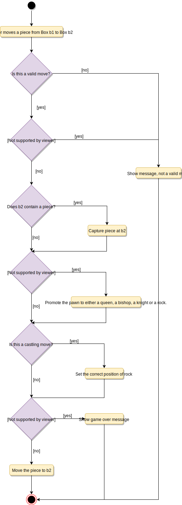

# Designing Chess

Chess is a two-player strategy board game played on a chessboard, which is a checkered gameboard with 64 squares arranged in an 8×8 grid. There are a few versions of game types that people play all over the world. In this design problem, we are going to focus on designing a two-player online chess game.

## Requirements

- The system should support two online players to play a game of chess.
- All rules of international chess will be followed.
- Each player will be randomly assigned a side, black or white.
- Both players will play their moves one after the other. The white side plays the first move.
- Players can’t cancel or roll back their moves.
- The system should maintain a log of all moves by both players.
- Each side will start with 8 pawns, 2 rooks, 2 bishops, 2 knights, 1 queen, and 1 king.
- The game can finish either in a checkmate from one side, forfeit or stalemate (a draw), or resignation.

## Use Case Diagram

### Actors

- Player: A registered account in the system, who will play the game. The player will play chess moves.
- Admin: To ban/modify players.

### Processes

- Player moves a piece: To make a valid move of any chess piece.
- Resign or forfeit a game: A player resigns from/forfeits the game.
- Register new account/Cancel membership: To add a new member or cancel an existing member.
- Update game log: To add a move to the game log.


## Class Diagram

- Player: Player class represents one of the participants playing the game. It keeps track of which side (black or white) the player is playing.
- Account: We’ll have two types of accounts in the system: one will be a player, and the other will be an admin.
- Game: This class controls the flow of a game. It keeps track of all the game moves, which player has the current turn, and the final result of the game.
- Box: A box represents one block of the 8x8 grid and an optional piece.
- Board: Board is an 8x8 set of boxes containing all active chess pieces.
- Piece: The basic building block of the system, every piece will be placed on a box. This class contains the color the piece represents and the status of the piece (that is, if the piece is currently in play or not). This would be an abstract class and all game pieces will extend it.
- Move: Represents a game move, containing the starting and ending box. The Move class will also keep track of the player who made the move, if it is a castling move, or if the move resulted in the capture of a piece.
- GameController: Player class uses GameController to make moves.
- GameView: Game class updates the GameView to show changes to the players.


## Activity Diagram

### Make Move



## Code

### Constants and Enums

```java
public enum GameStatus {
  ACTIVE, BLACK_WIN, WHITE_WIN, FORFEIT, STALEMATE, RESIGNATION
}

public enum AccountStatus {
  ACTIVE, CLOSED, CANCELED, BLACKLISTED, NONE
}

public class Address {
  private String streetAddress;
  private String city;
  private String state;
  private String zipCode;
  private String country;
}

public class Person {
  private String name;
  private Address address;
  private String email;
  private String phone;
}
```

### Box

```java
public class Box {
  private Piece piece;
  private int x;
  private int y;

  public Box(int x, int y, Piece piece) {
    this.setPiece(piece);
    this.setX(x);
    this.setY(y);
  }

  public Piece getPiece() {
    return this.piece;
  }

  public void setPiece(Piece p) {
    this.piece = p;
  }

  public int getX() {
    return this.x;
  }

  public void setX(int x) {
    this.x = x;
  }

  public int getY() {
    return this.y;
  }

  public void setY(int y) {
    this.y = y;
  }
}
```

### Piece

```java
public abstract class Piece {

  private boolean killed = false;
  private boolean white = false;

  public Piece(boolean white) {
    this.setWhite(white);
  }

  public boolean isWhite() {
    return this.white == true;
  }

  public void setWhite(boolean white) {
    this.white = white;
  }

  public boolean isKilled() {
    return this.killed == true;
  }

  public void setKilled(boolean killed) {
    this.killed = killed;
  }

  public abstract boolean canMove(Board board, Box start, Box end);
}
```

### King

```java
public class King extends Piece {
  private boolean castlingDone = false;

  public King(boolean white) {
    super(white);
  }

  public boolean isCastlingDone() {
    return this.castlingDone == true;
  }

  public void setCastlingDone(boolean castlingDone) {
    this.castlingDone = castlingDone;
  }

  @Override
  public boolean canMove(Board board, Box start, Box end) {
    // we can't move the piece to a box that has a piece of the same color
    if(end.getPiece().isWhite() == this.isWhite()) {
      return false;
    }

    int x = Math.abs(start.getX() - end.getX());
    int y = Math.abs(start.getY() - end.getY());
    if(x + y == 1) {
      // check if this move will not result in king being attacked, if so return true
      return true;
    }

    return this.isValidCastling(board, start, end);
  }

  private boolean isValidCastling(Board board, Box start, Box end) {

    if(this.isCastlingDone()) {
      return false;
    }

    // check for the white king castling
    if(this.isWhite()
      && start.getX() == 0 && start.getY() == 4 && end.getY() == 0) {
        // confirm if white king moved to the correct ending box
        if (Math.abs(end.getY() - start.getY()) == 2) {
          // check if there the Rook is in the correct position
          // check if there is no piece between Rook and the King
          // check if the King or the Rook has not moved before
          // check if this move will not result in king being attacked
          //...
          this.setCastlingDone(true);
          return true;
        }
    } else {
      // check for the black king castling
      this.setCastlingDone(true);
      return true;
    }

    return false;
  }

  public boolean isCastlingMove(Box start, Box end) {
    // check if the starting and ending position are correct
  }
}
```

### Knight

```java
public class Knight extends Piece {
  public Knight(boolean white) {
    super(white);
  }

  @Override
  public boolean canMove(Board board, Box start, Box end) {

    // we can't move the piece to a box that has a piece of the same color
    if(end.getPiece().isWhite() == this.isWhite()) {
      return false;
    }

    int x = Math.abs(start.getX() - end.getX());
    int y = Math.abs(start.getY() - end.getY());
    return x * y == 2;
  }
}

```

### Board

```java
public class Board {
  Box[][] boxes;

  public Board() {
    this.resetBoard();
  }

  public Box getBox(int x, int y) {

    if (x < 0 || x > 7 || y < 0 || y > 7) {
      throw new Exception("Index out of bound");
    }

    return boxes[x][y];
  }

  public void resetBoard() {
    // initialize white pieces
    boxes[0][0] = new Box(new Rook(true), 0, 0);
    boxes[0][1] = new Box(new Knight(true), 0, 1);
    boxes[0][2] = new Box(new Bishop(true), 0, 2);
    //...
    boxes[1][0] = new Box(new Pawn(true), 1, 0);
    boxes[1][1] = new Box(new Pawn(true), 1, 1);
    //...

    // initialize black pieces
    boxes[7][0] = new Box(new Rook(false), 7, 0);
    boxes[7][1] = new Box(new Knight(false), 7, 1);
    boxes[7][2] = new Box(new Bishop(false), 7, 2);
    //...
    boxes[6][0] = new Box(new Pawn(false), 6, 0);
    boxes[6][1] = new Box(new Pawn(false), 6, 1);
    //...

    // initialize remaining boxes without any piece
    for (int i = 2; i < 6; i++) {
      for (int j = 0; j < 8; j++) {
        boxes[i][j] = new Box(null, i, j);
      }
    }
  }
}
```

### Player

```java
public class Player extends Account{
  private Person person;
  private boolean whiteSide = false;

  public Player(Person person, boolean whiteSide){
    this.person = person;
    this.whiteSide = whiteSide;
  }

  public boolean isWhiteSide() {
    return this.whiteSide == true;
  }
}
```

### Move

```java
public class Move {
  private Player player;
  private Box start;
  private Box end;
  private Piece pieceMoved;
  private Piece pieceKilled;
  private boolean castlingMove = false;

  public Move(Player player, Box start, Box end){
    this.player = player;
    this.start = start;
    this.end = end;
    this.pieceMoved = start.getPiece();
  }

  public boolean isCastlingMove() {
    return this.castlingMove == true;
  }

  public void setCastlingMove(boolean castlingMove) {
    this.castlingMove = castlingMove;
  }
}
```

### Game

```java
public class Game {
  private Player[] players;
  private Board board;
  private Player currentTurn;
  private GameStatus status;
  private List<Move> movesPlayed;

  private void initialize(Player p1, Player p2) {
    players[0] = p1;
    players[1] = p2;

    board.resetBoard();

    if(p1.isWhiteSide()) {
      this.currentTurn = p1;
    } else {
      this.currentTurn = p2;
    }

    movesPlayed.clear();
  }

  public boolean isEnd() {
    return this.getStatus() != GameStatus.ACTIVE;
  }

  public boolean getStatus() {
    return this.status;
  }

  public void setStatus(GameStatus status) {
    this.status = status;
  }

  public boolean playerMove(Player player, int startX, int startY, int endX, int endY) {
      Box startBox = board.getBox(startX, startY);
      Box endBox = board.getBox(startY, endY);
      Move move = new Move(player, startBox, endBox);
      return this.makeMove(move, player);
  }

  private boolean makeMove(Move move, Player player) {
    Piece sourcePiece = move.getStart().getPiece();
    if (sourcePiece == null) {
      return false;
    }

    // valid player
    if (player != currentTurn) {
      return false;
    }

    if (sourcePiece.isWhite() != player.isWhiteSide()) {
      return false;
    }

    // valid move?
    if (!sourcePiece.canMove(board, move.getStart(), move.getEnd())){
      return false;
    }

    // kill?
    Piece destPiece = move.getStart().getPiece();
    if (destPiece != null) {
      destPiece.setKilled(true);
      move.setPieceKilled(destPiece);
    }

    // castling?
    if (sourcePiece != null && sourcePiece instanceof King
        && sourcePiece.isCastlingMove()) {
      move.setCastlingMove(true);
    }

    // store the move
    movesPlayed.add(move);

    // move piece from the stat box to end box
    move.getEnd().setPiece(move.getStart().getPiece());
    move.getStart.setPiece(null);

    if (destPiece != null && destPiece instanceof King) {
      if(player.isWhiteSide()) {
        this.setStatus(GameStatus.WHITE_WIN);
      } else {
        this.setStatus(GameStatus.BLACK_WIN);
      }
    }

    // set the current turn to the other player
    if(this.currentTurn == players[0]) {
      this.currentTurn = players[1];
    } else {
      this.currentTurn = players[0];
    }

    return true;
  }
}
```
