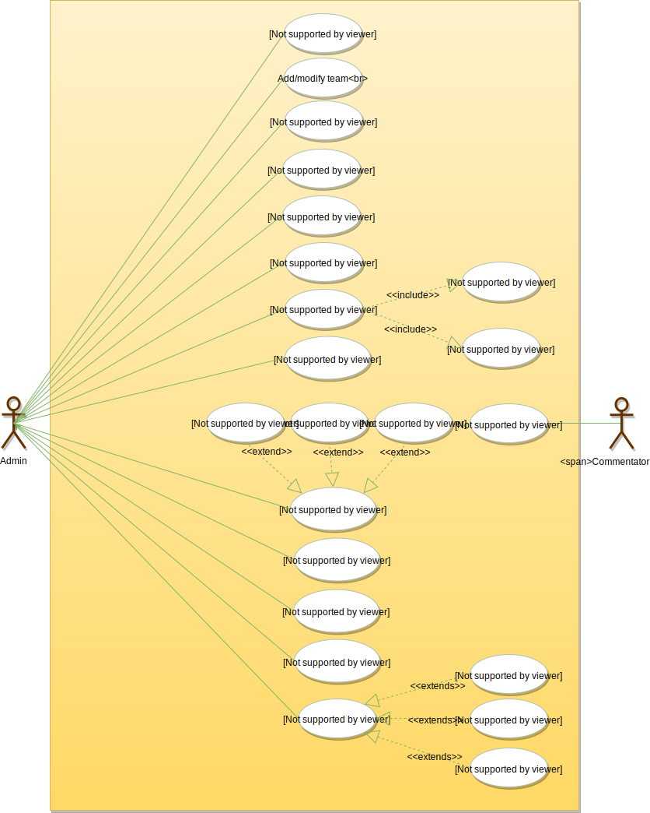
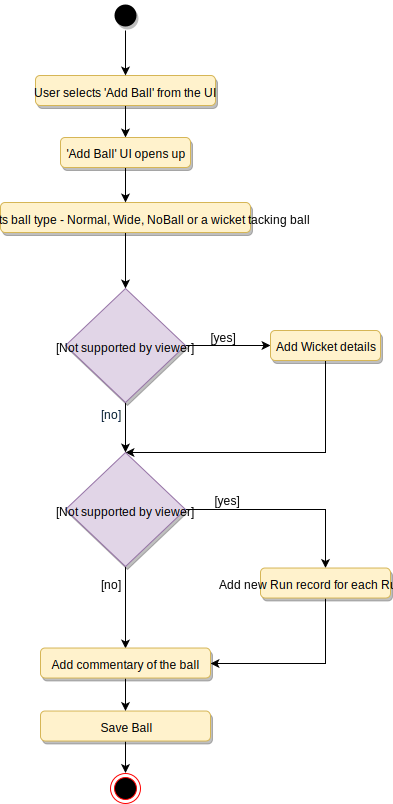

# Designing Cricinfo

Cricinfo is a sports news website exclusively for the game of cricket. The site features live coverage of cricket matches containing ball-by-ball commentary and a database for all the historic matches. The site also provides news and articles about cricket.

## Requirements

- The system should keep track of all cricket-playing teams and their matches.
- The system should show live ball-by-ball commentary of cricket matches.
- All international cricket rules should be followed.
- Any team playing a tournament will announce a squad (a set of players) for the tournament.
- For each match, both teams will announce their playing-eleven from the tournament squad.
- The system should be able to record stats about players, matches, and tournaments.
- The system should be able to answer global stats queries like, “Who is the highest wicket taker of all time?”, “Who has scored maximum numbers of 100s in test matches?”, etc.
- The system should keep track of all ODI, Test and T20 matches.

## Use Case Diagram

### Actors

- Admin: An Admin will be able to add/modify players, teams, tournaments, and matches, and will also record ball-by-ball details of each match.
- Commentator: Commentators will be responsible for adding ball-by-ball commentary for matches.

### Processes

- Add/modify teams and players: An Admin will add players to teams and keeps up-to-date information about them in the system.
- Add tournaments and matches: Admins will add tournaments and matches in the system.
- Add ball: Admins will record ball-by-ball details of a match.
- Add stadium, umpire, and referee: The system will keep track of stadiums as well as of the umpires and referees managing the matches.
- Add/update stats: Admins will add stats about matches and tournaments. The system will generate certain stats.
- Add commentary: Add ball-by-ball commentary of matches.



## Class Diagram

- Player: Keeps a record of a cricket player, their basic profile and contracts.
- Team: This class manages cricket teams.
- Tournament: Manages cricket tournaments and keeps track of the points table for all playing teams.
- TournamentSquad: Each team playing a tournament will announce a set of players who will be playing the tournament. TournamentSquad will encapsulate that.
- Playing11: Each team playing a match will select 11 players from their announced tournaments squad.
- Match: Encapsulates all information of a cricket match. Our system will support three match types: 1) ODI, 2) T20, and 3) Test
- Innings: Records all innings of a match.
- Over: Records details about an Over.
- Ball: Records every detail of a ball, such as the number of runs scored, if it was a wicket-taking ball, etc.
- Run: Records the number and type of runs scored on a ball. The different run types are: Wide, LegBy, Four, Six, etc.
- Commentator and Commentary: The commentator adds ball-by-ball commentary.
- Umpire and Referee: These classes will store details about umpires and referees, respectively.
- Stat: Our system will keep track of the stats for every player, match and tournament.
- StatQuery: This class will encapsulate general stat queries and their answers, like “Who has scored the maximum number of 100s in ODIs?” or, “Which bowler has taken the most wickets in test matches?”, etc.


## Activity Diagram

### Add Ball



## Code

### Constants and Enums

```java
public class Address {
  private String streetAddress;
  private String city;
  private String state;
  private String zipCode;
  private String country;
}

public class Person {
  private String name;
  private Address address;
  private String email;
  private String phone;
}

public enum MatchFormat {
  ODI,
  T20,
  TEST
}

public enum MatchResult {
  LIVE,
  FINISHED,
  DRAWN,
  CANCELED
}

public enum UmpireType {
  FIELD,
  RESERVED,
  TV
}

public enum WicketType {
  BOLD,
  CAUGHT,
  STUMPED,
  RUN_OUT,
  LBW,
  RETIRED_HURT,
  HIT_WICKET,
  OBSTRUCTING
}

public enum BallType {
  NORMAL,
  WIDE,
  WICKET,
  NO_BALL
}

public enum RunType {
  NORMAL,
  FOUR,
  SIX,
  LEG_BYE,
  BYE,
  NO_BALL,
  OVERTHROW
}
```

### Admin, Player, Umpire, Referee, and Commentator

```java
// For simplicity, we are not defining getter and setter functions. The reader can
// assume that all class attributes are private and accessed through their respective
// public getter method and modified only through their public setter method.

public class Player {
  private Person person;
  private ArrayList<PlayerContract> contracts;

  public boolean addContract();
}

public class Admin {
  private Person person;

  public boolean addMatch(Match match);

  public boolean addTeam(Team team);

  public boolean addTournament(Tournament tournament);
}

public class Umpire {
  private Person person;

  public boolean assignMatch(Match match);
}

public class Referee {
  private Person person;

  public boolean assignMatch(Match match);
}

public class Commentator {
  private Person person;

  public boolean assignMatch(Match match);
}
```

### Team, TournamentSquad, and Playing11

```java
public class Team {
  private String name;
  private List<Player> players;
  private List<News> news;
  private Coach coach;

  public boolean addTournamentSquad(TournamentSquad tournamentSquad);
  public boolean addPlayer(Player player);
  public boolean addNews(News news);
}

public class TournamentSquad {
  private List<Player> players;
  private List<TournamentStat> tournamentStats;

  public boolean addPlayer(Player player);
}

public class Playing11 {
  private List<Player> players;
  private Player twelfthMan;

  public boolean addPlayer(Player player);
}
```

### Over, Ball, Wicket, Commentary, Inning, and Match

```java
public class Over {
  private int number;
  private List<Ball> balls;

  public boolean addBall(Ball ball);
}

public class Ball {
  private Player balledBy;
  private Player playedBy;
  private BallType type;

  private Wicket wicket;
  private List<Run> runs;
  private Commentary commentary;

}

public class Wicket {
  private WicketType wicketType;
  private Player playerOut;
  private Player caughtBy;
  private Player runoutBy;
  private Player stumpedBy;
}

public class Commentary {
  private String text;
  private Date createdAt;
  private Commentator createdBy;
}

public class Inning {
  private int number;
  private Date startTime;
  private List<Over> overs;

  public boolean addOver(Over over);
}

public abstract class Match {
  private int number;
  private Date startTime;
  private MatchResult result;

  private Playing11[] teams;
  private List<Inning> innings;
  private List<Umpire> umpires;
  private Referee referee;
  private List<Commentator> commentators;
  private List<MatchStat> matchStats;

  public boolean assignStadium(Stadium stadium);

  public boolean assignReferee(Referee referee);
}

public class ODI extends Match {
  //...
}

public class Test extends Match {
  //...
}
```
