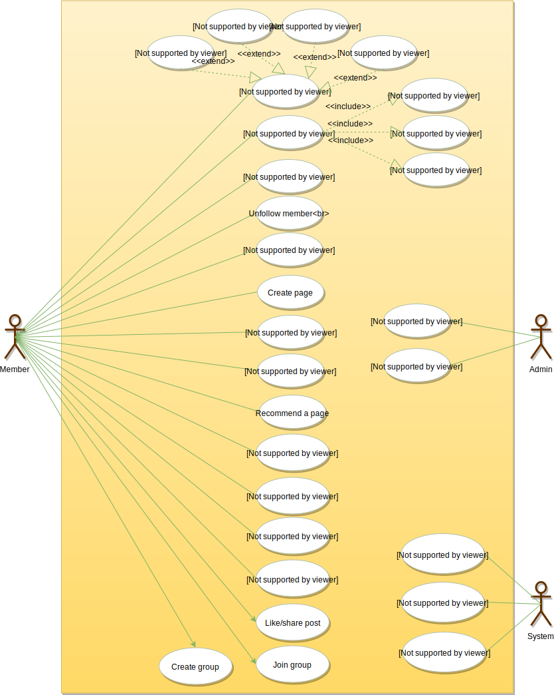
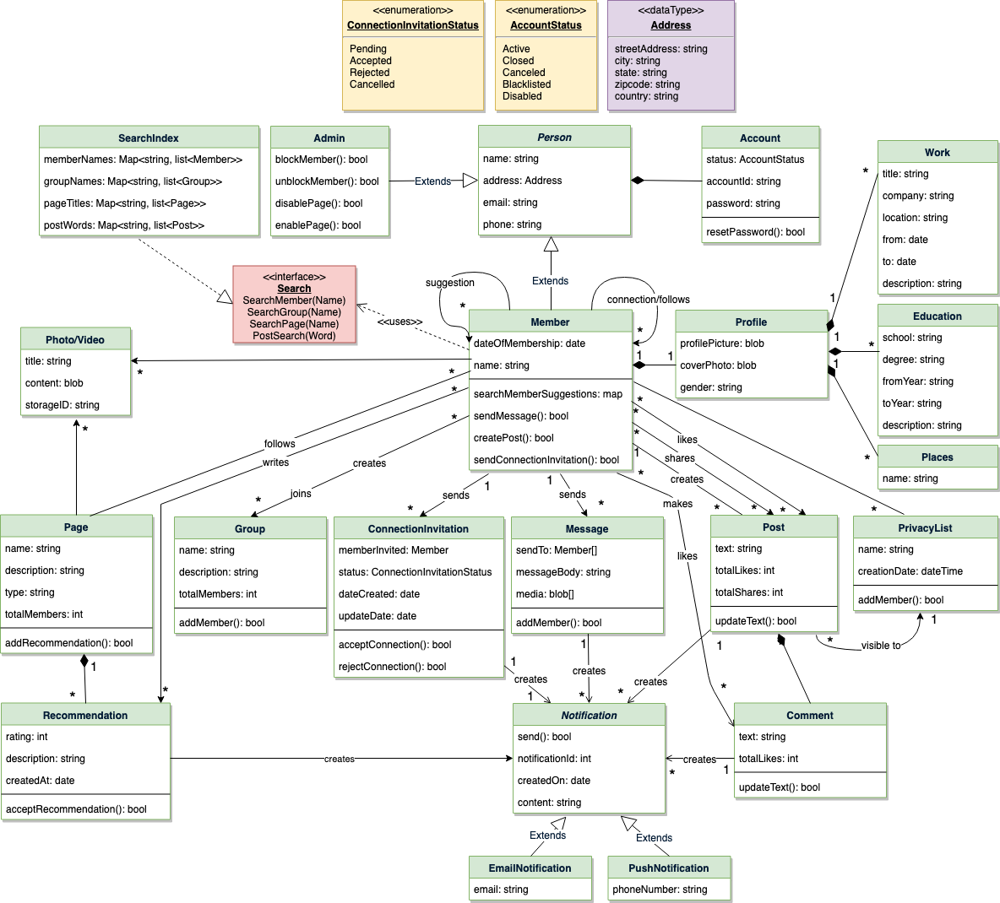
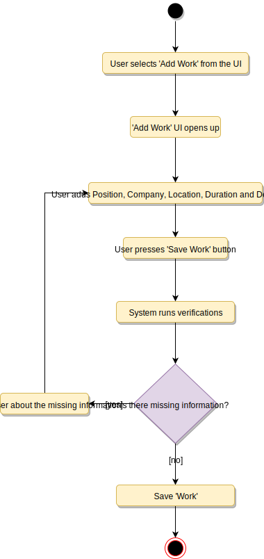
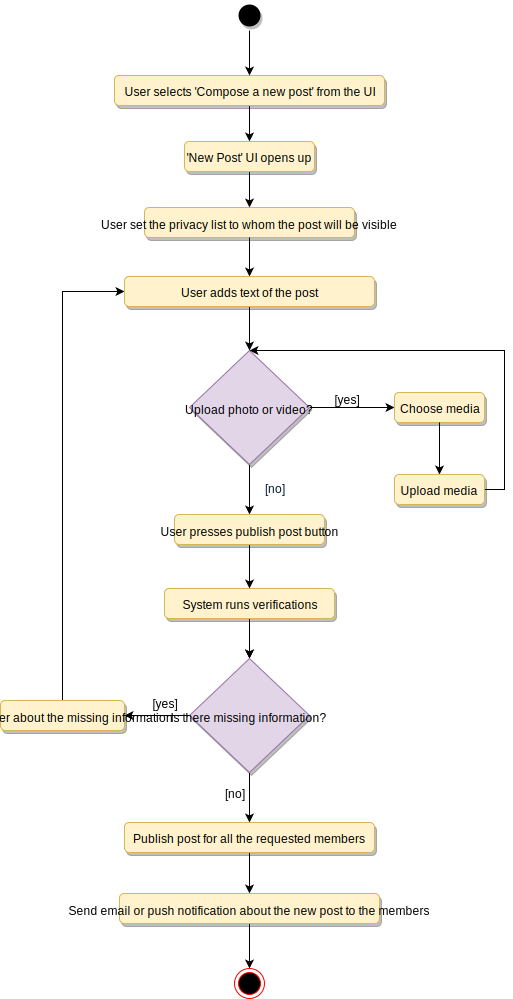

# Designing Facebook

Facebook is an online social networking service where users can connect with other users to post and read messages. Users access Facebook through their website interface or mobile apps.

## Requirements

- Each member should be able to add information about their basic profile, work experience, education, etc.
- Any user of our system should be able to search other members, groups or pages by their name.
- Members should be able to send and accept/reject friend requests from other members.
- Members should be able to follow other members without becoming their friend.
- Members should be able to create groups and pages, as well as join already created groups, and follow pages.
- Members should be able to create new posts to share with their friends.
- Members should be able to add comments to posts, as well as like or share a post or comment.
- Members should be able to create privacy lists containing their friends. Members can link any post with a privacy list to make the post visible only to the members of that list.
- Any member should be able to send messages to other members.
- Any member should be able to add a recommendation for any page.
- The system should send a notification to a member whenever there is a new message or friend request or comment on their post.
- Members should be able to search through posts for a word.

## Use Case Diagram

### Actors

- Member: All members can search for other members, groups, pages, or posts, as well as send friend requests, create posts, etc.
- Admin: Mainly responsible for admin functions like blocking and unblocking a member, etc.
- System: Mainly responsible for sending notifications for new messages, friend requests, etc.

### Processes

- Add/update profile: Any member should be able to create their profile to reflect their work experiences, education, etc.
- Search: Members can search for other members, groups or pages. Members can send a friend request to other members.
- Follow or Unfollow a member or a page: Any member can follow or unfollow any other member or page.
- Send message Any member can send a message to any of their friends.
- Create post Any member can create a post to share with their friends, as well as like or add comments to any post visible to them.
- Send notification The system will be able to send notifications for new messages, friend requests, etc.



## Class Diagram

- Member: This will be the main component of our system. Each member will have a profile which includes their Work Experiences, Education, etc. Members will be connected to other members and they can follow other members and pages. Members will also have suggestions to send friend requests to other members.
- Search: Our system will support searching for other members, groups and pages by their names, and through posts for any word.
- Message: Members can send messages to other members with text, photos, and videos.
- Post: Members can create posts containing text and media, as well as like and share a post.
- Comment: Members can add comments to posts as well as like any comment.
- Group: Members can create and join groups.
- PrivacyList: Members can create privacy lists containing their friends. Members can link any post with a privacy list, to make the post visible only to the members of that list.
- Page: Members can create pages that other members can follow, and share messages there.
- Notification: This class will take care of sending notifications to members. The system will be able to send a push notification or an email.




## Activity Diagram

### Add Experience



### Create Post



## Code

### Constants and Enums

```java
public enum ConnectionInvitationStatus{
  PENDING,
  ACCEPTED,
  REJECTED,
  CANCELED
}

public enum AccountStatus{
  ACTIVE,
  CLOSED,
  CANCELED,
  BLACKLISTED,
  DISABLED
}

public class Address {
  private String streetAddress;
  private String city;
  private String state;
  private String zipCode;
  private String country;
}
```

### Account, Person, Member, and Admin

```java
// For simplicity, we are not defining getter and setter functions. The reader can
// assume that all class attributes are private and accessed through their respective
// public getter method and modified only through their public setter method.

public class Account {
  private String id;
  private String password;
  private AccountStatus status;

  public boolean resetPassword();
}

public abstract class Person {
  private String name;
  private Address address;
  private String email;
  private String phone;

  private Account account;
}

public class Member extends Person {
  private Integer memberId;
  private Date dateOfMembership;
  private String name;

  private Profile profile;
  private HashSet<Integer> memberFollows;
  private HashSet<Integer> memberConnections;
  private HashSet<Integer> pageFollows;
  private HashSet<Integer> memberSuggestions;
  private HashSet<ConnectionInvitation> connectionInvitations;
  private HashSet<Integer> groupFollows;

  public boolean sendMessage(Message message);
  public boolean createPost(Post post);
  public boolean sendConnectionInvitation(ConnectionInvitation invitation);
  private Map<Integer, Integer> searchMemberSuggestions();
}

public class Admin extends Person {
  public boolean blockUser(Customer customer);
  public boolean unblockUser(Customer customer);
  public boolean enablePage(Page page);
  public boolean disablePage(Page page);
}

public class ConnectionInvitation {
  private Member memberInvited;
  private ConnectionInvitationStatus status;
  private Date dateCreated;
  private Date dateUpdated;

  public bool acceptConnection();
  public bool rejectConnection();
}
```

### Profile and Work

```java
public class Profile {
  private byte[] profilePicture;
  private byte[] coverPhoto;
  private String gender;

  private List<Work> workExperiences;
  private List<Education> educations;
  private List<Place> places;
  private List<Stat> stats;

  public boolean addWorkExperience(Work work);
  public boolean addEducation(Education education);
  public boolean addPlace(Place place);
}

public class Work {
  private String title;
  private String company;
  private String location;
  private Date from;
  private Date to;
  private String description;
}
```

### Page and Recommendation

```java
public class Page {
  private Integer pageId;
  private String name;
  private String description;
  private String type;
  private int totalMembers;
  private List<Recommendation> recommendation;

  private List<Recommendation> getRecommendation();
}

public class Recommendation {
  private Integer recommendationId;
  private int rating;
  private String description;
  private Date createdAt;
}
```

### Group, Post, Message, and Comment

```java
public class Group {
  private Integer groupId;
  private String name;
  private String description;
  private int totalMembers;
  private List<Member> members;

  public boolean addMember(Member member);
  public boolean updateDescription(String description);
}

public class Post {
  private Integer postId;
  private String text;
  private int totalLikes;
  private int totalShares;
  private Member owner;
}

public class Message {
  private Integer messageId;
  private Member[] sentTo;
  private String messageBody;
  private byte[] media;

  public boolean addMember(Member member);
}

public class Comment {
  private Integer commentId;
  private String text;
  private int totalLikes;
  private Member owner;
}
```

### Search Interface and SearchIndex

```java
public interface Search {
  public List<Member> searchMember(String name);
  public List<Group> searchGroup(String name);
  public List<Page> searchPage(String name);
  public List<Post> searchPost(String word);
}

public class SearchIndex implements Search {
   HashMap<String, List<Member>> memberNames;
   HashMap<String, List<Group>> groupNames;
   HashMap<String, List<Page>> pageTitles;
   HashMap<String, List<Post>> posts;

   public boolean addMember(Member member) {
     if(memberNames.containsKey(member.getName())) {
       memberNames.get(member.getName()).add(member);
     } else {
       memberNames.put(member.getName(), member);
     }
   }

   public boolean addGroup(Group group);
   public boolean addPage(Page page);
   public boolean addPost(Post post);

  public List<Member> searchMember(String name) {
    return memberNames.get(name);
  }

  public List<Group> searchGroup(String name) {
    return groupNames.get(name);
  }

  public List<Page> searchPage(String name) {
    return pageTitles.get(name);
  }

  public List<Post> searchPost(String word) {
    return posts.get(word);
  }
}
```
