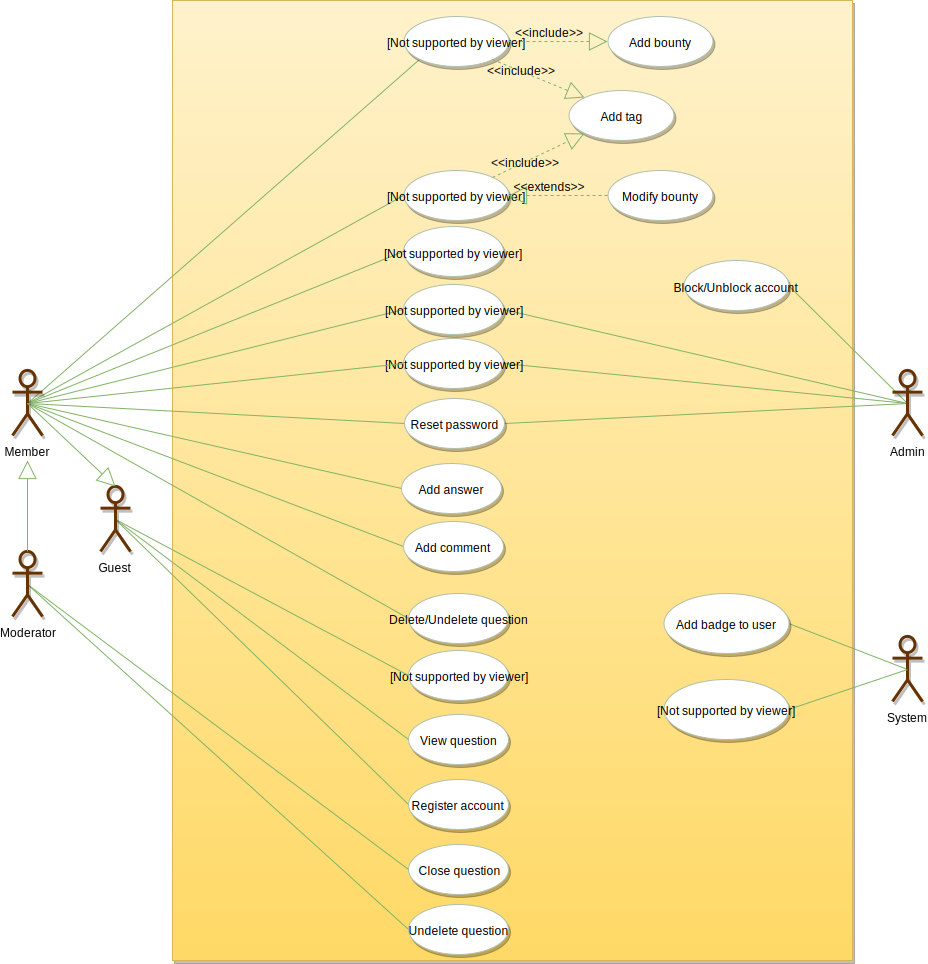
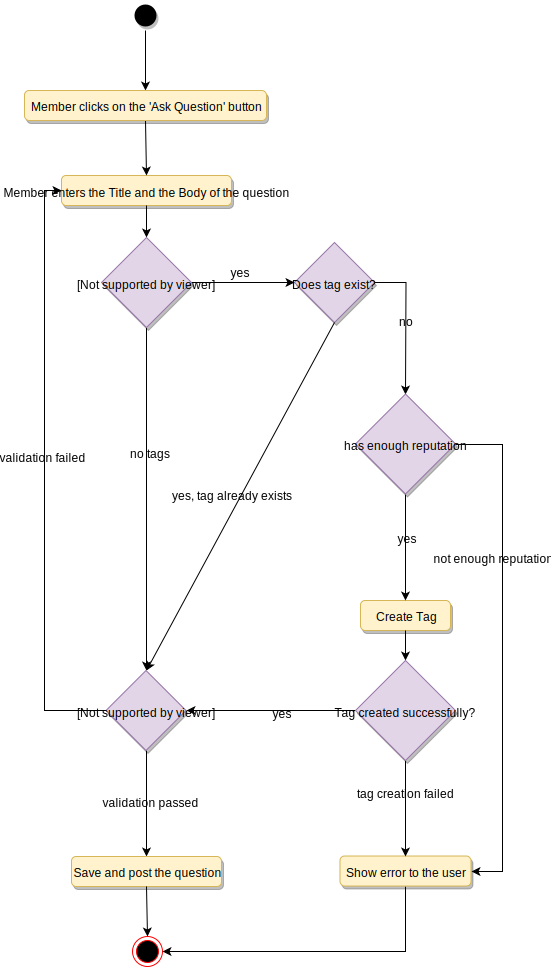
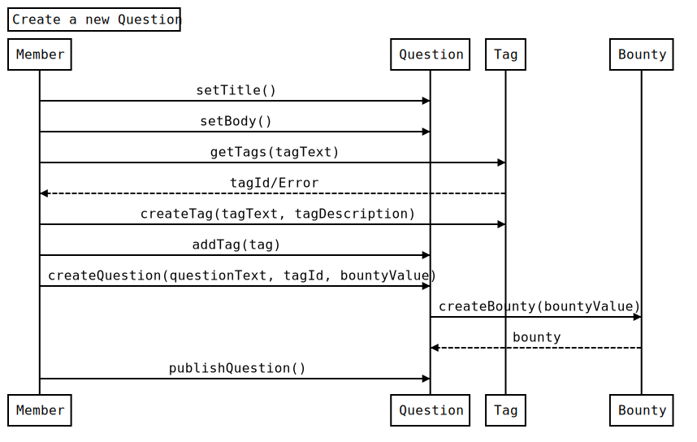

# Designing Stack Overflow

Stack Overflow is one of the largest online communities for developers to learn and share their knowledge. The website provides a platform for its users to ask and answer questions, and through membership and active participation, to vote questions and answers up or down. Users can edit questions and answers in a fashion similar to a wiki.

Users of Stack Overflow can earn reputation points and badges. For example, a person is awarded ten reputation points for receiving an “up” vote on an answer and five points for the “up” vote of a question. The can also receive badges for their valued contributions. A higher reputation lets users unlock new privileges like the ability to vote, comment on, and even edit other people’s posts.

## Requirements

- Any non-member (guest) can search and view questions. However, to add or upvote a question, they have to become a member.
- Members should be able to post new questions.
- Members should be able to add an answer to an open question.
- Members can add comments to any question or answer.
- Members can upvote a question, answer or comment.
- Members can flag a question, answer or comment, for serious problems or moderator attention.
- Members can add a bounty to their question to draw attention.
- Members will earn badges for being helpful.
- Members can vote to close a question; Moderators can close or reopen any question.
- Members can add tags to their questions. A tag is a word or phrase that describes the topic of the question.
- Members can vote to delete extremely off-topic or very low-quality questions.
- Moderators can close a question or undelete an already deleted question.
- The system should also be able to identify most frequently used tags in the questions.

## Use Case Diagram

### Actors

- Admin: Mainly responsible for blocking or unblocking members.
- Guest: All guests can search and view questions.
- Member: Members can perform all activities that guests can, in addition to which they can add/remove questions, answers, and comments. Members can delete and un-delete their questions, answers or comments.
- Moderator: In addition to all the activities that members can perform, moderators can close/delete/undelete any question.
- System: Mainly responsible for sending notifications and assigning badges to members.

### Processes

- Search questions.
- Create a new question with bounty and tags.
- Add/modify answers to questions.
- Add comments to questions or answers.
- Moderators can close, delete, and un-delete any question.



## Class Diagram

- Question: This class is the central part of our system. It has attributes like Title and Description to define the question. In addition to this, we will track the number of times a question has been viewed or voted on. We should also track the status of a question, as well as closing remarks if the question is closed.
- Answer: The most important attributes of any answer will be the text and the view count. In addition to that, we will also track the number of times an answer is voted on or flagged. We should also track if the question owner has accepted an answer.
- Comment: Similar to answer, comments will have text, and view, vote, and flag counts. Members can add comments to questions and answers.
- Tag: Tags will be identified by their names and will have a field for a description to define them. We will also track daily and weekly frequencies at which tags are associated with questions.
- Badge: Similar to tags, badges will have a name and description.
- Photo: Questions or answers can have photos.
- Bounty: Each member, while asking a question, can place a bounty to draw attention. Bounties will have a total reputation and an expiry date.
- Account: We will have four types of accounts in the system, guest, member, admin, and moderator. Guests can search and view questions. Members can ask questions and earn reputation by answering questions and from bounties.
- Notification: This class will be responsible for sending notifications to members and assigning badges to members based on their reputations.


## Activity Diagram

### Create Question



## Sequence Diagram

### Create Question



## Code

### Constants and Enums

```java
public enum QuestionStatus{
  OPEN,
  CLOSED,
  ON_HOLD,
  DELETED
}

public enum QuestionClosingRemark{
  DUPLICATE,
  OFF_TOPIC,
  TOO_BROAD,
  NOT_CONSTRUCTIVE,
  NOT_A_REAL_QUESTION,
  PRIMARILY_OPINION_BASED
}

public enum AccountStatus{
  ACTIVE,
  CLOSED,
  CANCELED,
  BLACKLISTED,
  BLOCKED
}
```

### Account, Member, Admin, and Moderator

```java
// For simplicity, we are not defining getter and setter functions. The reader can
// assume that all class attributes are private and accessed through their respective
// public getter methods and modified only through their public methods function.

public class Account {
  private String id;
  private String password;
  private AccountStatus status;
  private String name;
  private Address address;
  private String email;
  private String phone;
  private int reputation;

  public boolean resetPassword();
}

public class Member {
  private Account account;
  private List<Badge> badges;

  public int getReputation();
  public String getEmail();
  public boolean createQuestion(Question question);
  public boolean createTag(Tag tag);
}

public class Admin extends Member {
  public boolean blockMember(Member member);
  public boolean unblockMember(Member member);
}

public class Moderator extends Member {
  public boolean closeQuestion(Question question);
  public boolean undeleteQuestion(Question question);
}
```

### Badge, Tag, and Notification

```java
public class Badge {
  private String name;
  private String description;
}

public class Tag {
  private String name;
  private String description;
  private long dailyAskedFrequency;
  private long weeklyAskedFrequency;
}

public class Notification {
  private int notificationId;
  private Date createdOn;
  private String content;

  public boolean sendNotification();
}
```

### Photo and Bounty

```java
public class Photo {
  private int photoId;
  private String photoPath;
  private Date creationDate;

  private Member creatingMember;

  public boolean delete();
}

public class Bounty {
  private int reputation;
  private Date expiry;

  public boolean modifyReputation(int reputation);
}
```

### Question, Comment and Answer

```java
public interface Search {
  public static List<Question> search(String query);
}

public class Question implements Search {
  private String title;
  private String description;
  private int viewCount;
  private int voteCount;
  private Date creationTime;
  private Date updateTime;
  private QuestionStatus status;
  private QuestionClosingRemark closingRemark;

  private Member askingMember;
  private Bounty bounty;
  private List<Photo> photos;
  private List<Comment> comments;
  private List<Answer> answers;

  public boolean close();
  public boolean undelete();
  public boolean addComment(Comment comment);
  public boolean addBounty(Bounty bounty);

  public static List<Question> search(String query) {
    // return all questions containing the string query in their title or description.
  }
}

public class Comment {
  private String text;
  private Date creationTime;
  private int flagCount;
  private int voteCount;

  private Member askingMember;

  public boolean incrementVoteCount();
}

public class Answer {
  private String answerText;
  private boolean accepted;
  private int voteCount;
  private int flagCount;
  private Date creationTime;

  private Member creatingMember;
  private List<Photo> photos;

  public boolean incrementVoteCount();
}
```
